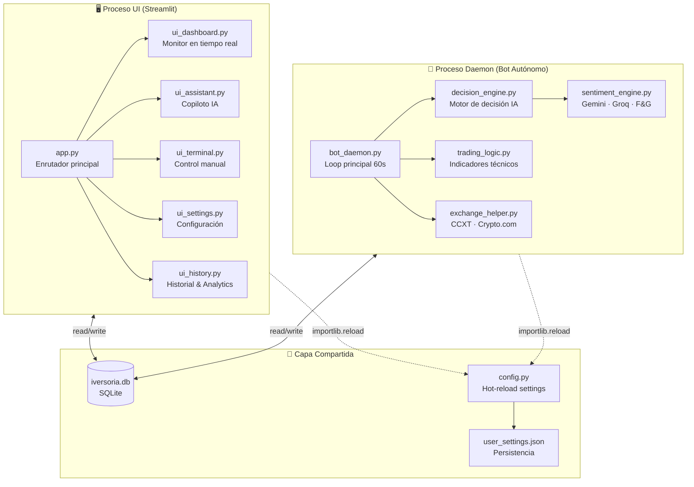
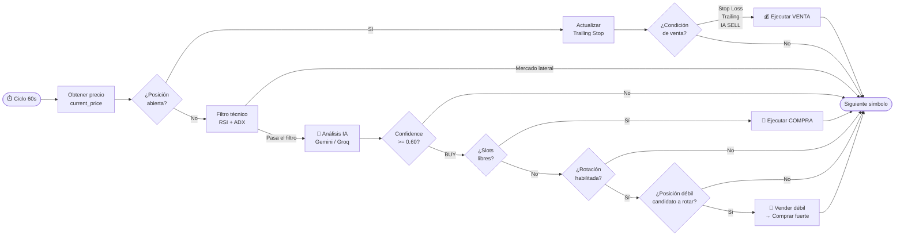
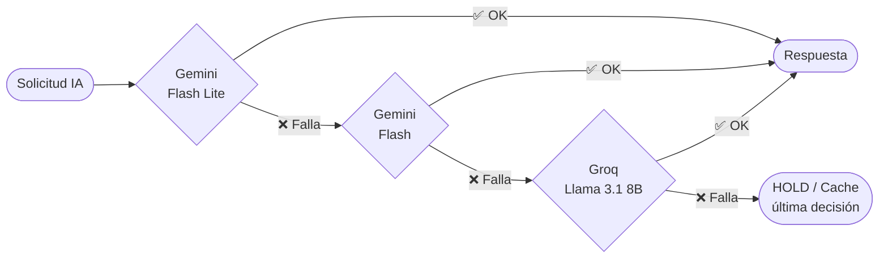
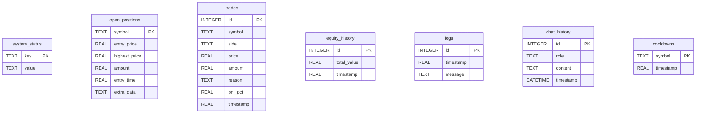

# 🏛️ INVERSORIA — Autonomous Trading Agent v5.0

[](https://python.org)
[](https://streamlit.io)
[](https://sqlite.org)
[](https://crypto.com)
[](https://ai.google.dev)
[](LICENSE)

> **INVERSORIA** es un agente de trading autónomo de grado institucional para el mercado de criptomonedas. Fusiona análisis técnico clásico con inteligencia artificial generativa (Google Gemini + Groq) para tomar decisiones de compra, venta y rotación de capital de forma autónoma, con una interfaz de control en tiempo real.

---

## 📐 Arquitectura del Sistema

INVERSORIA opera con **dos procesos paralelos** que se comunican exclusivamente a través de una base de datos SQLite local:



### Flujo de decisión de trading



### Cascada de IAs (Fallback garantizado 24/7)



---

## 🗄️ Esquema de Base de Datos



---

## 🚀 Guía de Despliegue

### Requisitos previos
- Python 3.11 o superior
- Cuenta en [Crypto.com Exchange](https://crypto.com/exchange) con API habilitada
- Al menos una clave de IA: [Google AI Studio](https://aistudio.google.com) o [Groq](https://console.groq.com)

### Instalación paso a paso

```bash
# 1. Clonar el repositorio
git clone https://github.com/R3v180/inversoria.git
cd inversoria

# 2. Crear entorno virtual (recomendado)
python -m venv venv
source venv/bin/activate      # Linux/Mac
# o: venv\Scripts\activate    # Windows

# 3. Instalar dependencias
pip install -r requirements.txt

# 4. Configurar credenciales
cp .env.example .env
# Edita .env con tus claves de API
```

### Configurar `.env`

```ini
# Exchange (solo para modo REAL)
CRYPTO_API_KEY=tu_api_key_aqui
CRYPTO_API_SECRET=tu_api_secret_aqui

# Inteligencia Artificial (al menos uno es obligatorio)
GOOGLE_API_KEY=tu_google_ai_key
GROQ_API_KEY=tu_groq_api_key

# Noticias (opcional pero recomendado)
COINDESK_API_KEY=tu_cryptocompare_key
```

### Arranque

**Terminal 1 — Interfaz de Usuario:**
```bash
streamlit run app.py
# Accede en http://localhost:8501
```

**Terminal 2 — Bot Autónomo:**
```bash
python bot_daemon.py
# El daemon corre en background y escribe en SQLite
```

> ⚠️ **Importante**: La UI y el Daemon son **procesos independientes**. Puedes cerrar el navegador y el bot seguirá operando. La UI solo visualiza datos; el Daemon toma las decisiones.

---

## ⚙️ Referencia de Configuración

Todos los parámetros son editables desde la UI en **Configuración → Centro de Mandos** sin necesidad de reiniciar el Daemon (hot-reload automático).

| Parámetro | Por defecto | Descripción |
|---|---|---|
| `MODO_SIMULACION` | `true` | `true` = dinero ficticio; `false` = fondos reales |
| `PRESUPUESTO_INICIAL` | `60.0` | Capital inicial en USDT para calcular PnL |
| `MONEDAS` | `BTC,ETH,SOL,ADA,DOT` | Watchlist estática (se sobrescribe con radar dinámico) |
| `RISK_PER_TRADE` | `0.10` | Fracción del balance USDT a arriesgar por operación (10%) |
| `MAX_OPEN_POSITIONS` | `3` | Máximo de posiciones abiertas simultáneas |
| `MIN_PROFIT_NET` | `1.0` | Profit mínimo objetivo en % |
| `STOP_LOSS_PERCENT` | `3.0` | Stop Loss fijo en % desde precio de entrada |
| `ROTATION_ENABLED` | `true` | Activar rotación inteligente de capital |
| `ROTATION_MIN_PROFIT` | `0.35` | Profit mínimo (%) para que una posición sea candidata a rotar |
| `ROTATION_CONFIDENCE_GAP` | `0.20` | Diferencia mínima de confianza IA entre nueva señal y posición actual |
| `ROTATION_MIN_NEW_CONFIDENCE` | `0.85` | Confianza mínima de la nueva señal para activar rotación |
| `AI_ANALYSIS_INTERVAL` | `1200` | Segundos entre análisis IA por símbolo (20 min = ahorro de tokens) |

### Parámetros de riesgo explicados

```
Ejemplo con PRESUPUESTO=60 USDT, RISK_PER_TRADE=10%:
├── Cada compra usa: 60 × 0.10 = 6 USDT
├── Con MAX_OPEN_POSITIONS=3: exposición máxima = 18 USDT (30%)
└── STOP_LOSS=3%: pérdida máxima por operación = 0.18 USDT
```

---

## 🛡️ Sistema de Gestión de Riesgo

### Stop Loss Fijo
Se activa inmediatamente si el precio cae por debajo de `entry_price × (1 - STOP_LOSS_PERCENT/100)`.

### Trailing Stop Loss
Se activa solo cuando la posición ha ganado más del **+5%**. A partir de ese punto, si el precio cae un **-1.5% desde el máximo histórico** del trade, se ejecuta la venta asegurando las ganancias.

```
Ejemplo:
Entrada: $100
Máximo alcanzado: $107 (+7%)
Trailing Stop activado: $107 × (1 - 0.015) = $105.40
→ Si precio baja a $105.40, el bot vende y asegura +5.4%
```

### Rotación de Capital
Cuando se alcanza `MAX_OPEN_POSITIONS` y llega una señal BUY con alta confianza:

```
Nueva señal: confidence=0.92
Posición candidata: ADA (confidence entrada=0.68, profit actual=+0.8%)

¿Rotar?
├── profit >= ROTATION_MIN_PROFIT (0.8 >= 0.35) ✅
├── new_conf - entry_conf >= ROTATION_CONFIDENCE_GAP (0.92 - 0.68 = 0.24 >= 0.20) ✅
└── new_conf >= ROTATION_MIN_NEW_CONFIDENCE (0.92 >= 0.85) ✅
→ ROTACIÓN APROBADA: vender ADA → comprar nueva señal
```

---

## 🧠 Módulos de Inteligencia Artificial

### `sentiment_engine.py` — Motor de Sentimiento
- Consume noticias de CryptoCompare API
- Fear & Greed Index de alternative.me (caché 24h)
- Cascada de fallback: Gemini Flash Lite → Gemini Flash → Groq Llama 3.1 8B
- Caché de análisis por símbolo: 20 minutos

### `decision_engine.py` — Motor de Decisión
Genera para cada símbolo un JSON con:
```json
{
  "regime": "TRENDING_UP | TRENDING_DOWN | RANGING | HIGH_VOLATILITY",
  "best_strategy": "TREND_FOLLOWING | MEAN_REVERSION | BREAKOUT | MOMENTUM",
  "action": "BUY | SELL | HOLD",
  "confidence": 0.87,
  "position_size_multiplier": 1.2,
  "stop_loss_atr": 1.5,
  "take_profit_ratio": 2.5,
  "reasoning": "EMA50 > EMA200 con volumen creciente..."
}
```

### Filtro Técnico Pre-IA (ahorro de tokens)
Antes de llamar a la IA, se aplica un filtro técnico rápido:
- Si `40 < RSI < 60` **Y** `ADX < 20` → mercado lateral → HOLD directo (sin consumir tokens)

### Radar Dinámico (cada 12 horas)
1. Obtiene el Top 30 de criptos por volumen en Crypto.com
2. Envía la lista a la IA para curación ("elimina memecoins sin fundamento")
3. La IA devuelve 15-20 monedas con proyectos sólidos o tendencia legítima
4. El daemon actualiza su `active_symbols` para el siguiente ciclo

---

## 📊 Indicadores Técnicos (`trading_logic.py`)

| Indicador | Período | Uso |
|---|---|---|
| RSI | 14 velas | Sobrecompra/venta + filtro lateral |
| EMA | 50 y 200 velas | Determinación de tendencia (BULL/BEAR) |
| ATR | 14 velas | Volatilidad del activo (stop dinámico) |
| ADX | 14 velas | Fuerza de la tendencia (filtro lateral) |

> **Anti-repainting**: Los indicadores se calculan sobre `df.iloc[:-1]` (velas cerradas), excluyendo la vela actual que aún no ha cerrado. Esto evita señales falsas por datos incompletos.

---

## 🖥️ Interfaz de Usuario

| Módulo | Descripción |
|---|---|
| **Dashboard** | Equity en tiempo real, gráfico de velas (candlestick + EMA + RSI + ATR), posiciones activas con PnL, radar de oportunidades 24h |
| **Terminal de Trading** | Control manual de órdenes, logs del daemon en tiempo real |
| **Asistente IA** | Chat conversacional con contexto real de la cartera. La IA propone, el usuario decide |
| **Historial & Analytics** | Tabla completa de trades, estadísticas de rendimiento |
| **Configuración** | Todos los parámetros editables en caliente sin reiniciar el daemon |

---

## ⚠️ Aviso Legal

> Este software es una herramienta de asistencia avanzada para análisis de mercados. El trading de criptomonedas conlleva **riesgo significativo de pérdida de capital**. La IA puede cometer errores de análisis. La responsabilidad de cada operación real recae **exclusivamente en el usuario**.
>
> Se recomienda **siempre comenzar en modo Simulación** hasta validar el comportamiento del sistema con tu configuración específica.

---

## 🛠️ Stack Tecnológico

| Componente | Tecnología |
|---|---|
| Lenguaje | Python 3.11+ |
| UI | Streamlit + Plotly |
| Exchange | CCXT → Crypto.com |
| IA Principal | Google Gemini (Flash Lite / Flash) |
| IA Fallback | Groq (Llama 3.1 8B Instant) |
| Análisis técnico | Pandas-TA |
| Base de datos | SQLite (concurrencia con timeout) |
| Datos de mercado | CryptoCompare API |
| Sentimiento | alternative.me Fear & Greed Index |

---

*INVERSORIA v5.0 — Inteligencia Autónoma para el Inversor del Futuro*
