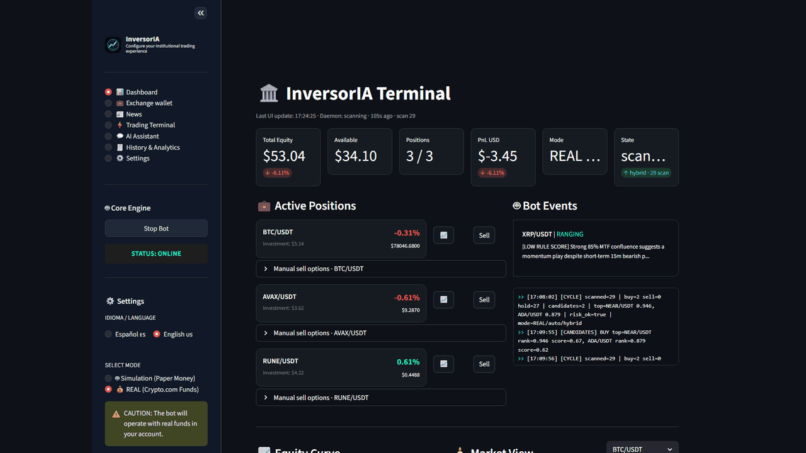
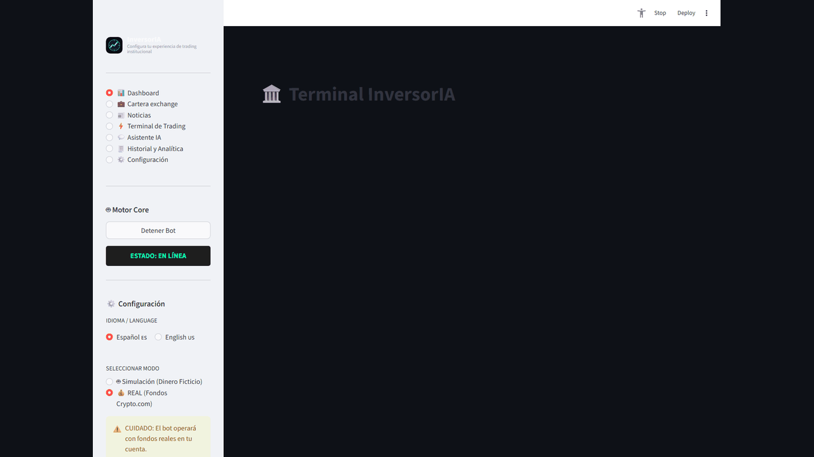

# InversorIA - AI-Assisted Quantitative Crypto Trading Platform

### Autonomous crypto trading platform with hybrid AI, adaptive scoring, decision journal, portfolio risk guards, backtesting, macro filters and safe execution modes.

Maintained by Olivier Hottelet, trading as OHCodex: https://ohcodex.com

**Language / Idioma:** 🇬🇧 [English](#english-overview) | 🇪🇸 [Español](#resumen-en-español)

**Full documentation:** 🇬🇧 [English docs](#english-documentation) | 🇪🇸 [Documentación en español](#documentación-en-español)

> Disclaimer: InversorIA is not financial advice. Real mode can place real orders on Crypto.com. Use minimal API permissions, start in simulation, and verify every behavior before trading real funds.

## English Overview

### What Makes InversorIA Different

- **Not blind AI trading**: AI suggestions are checked against deterministic scoring, technical indicators, multi-timeframe context, macro filters and historical priors.
- **Simulation-first workflow**: isolated paper-trading profiles let you test different risk settings without contaminating real data.
- **Auditable decisions**: every signal, block, execution, size, risk reason and realized outcome can be written to `decision_journal`.
- **Strategy evaluation checkpoints**: mark named reference points (reset, preset, mode change, manual) to compare performance and filter history from a baseline equity without altering live config.
- **Risk controls before execution**: portfolio, symbol, alt and bucket exposure guards can cap size or block unsafe buys.
- **Autopilot hardening**: operational kill-switches, optional local AI budgets (provider quotas apply by default), order reconciliation, symbol cooldowns, ATR exits, macro hysteresis, backtest reliability/Monte Carlo metrics and advanced-edge gates are configurable instead of hardcoded.
- **Bilingual UI (ES/EN)**: Streamlit strings and configuration labels use the central `i18n` dictionary; see [docs/I18N.md](docs/I18N.md).
- **Real balances are protected**: existing sellable balances can be adopted into active management even if they are outside the new-buy watchlist.
- **Local-first architecture**: Streamlit UI, daemon and SQLite run locally; API keys stay in `.env`/environment variables instead of `user_settings.json`.

### Quick Start

```bash
git clone https://github.com/R3v180/inversoria
cd inversoria
python -m venv venv
```

Windows PowerShell:

```powershell
.\venv\Scripts\Activate.ps1
pip install -r requirements.txt
python -m streamlit run app.py
```

For normal Windows use, build or run the launcher and start in simulation mode:

```bat
build_launcher.bat
InversorIA.exe
```

### Core Modules: Start Here

- `bot_daemon.py`: autonomous scan cycle, execution governance, adoption, sizing and rotation.
- `decision_engine.py`: hybrid AI/quant decision logic and adaptive score adjustments.
- `trading_logic.py`: indicators, stop loss, trailing stop and sell conditions.
- `database_manager.py`: SQLite persistence, trades, positions, diagnostics and `decision_journal`.
- `exchange_helper.py`: Crypto.com/CCXT access, simulation account, balances and pre-checks.
- `app.py` and `ui_*.py`: Streamlit interface.

### Limitations And Risks

- This project does **not** promise profit and should not be treated as financial advice.
- Backtests and simulated trades can overfit, ignore liquidity reality or fail to represent future markets.
- AI providers can be unavailable, hallucinate, overreact to news or produce inconsistent reasoning.
- Real mode can place real orders. Use small capital, no withdrawal permissions and strict API key controls.
- SQLite is appropriate for the local app, but a future hosted/SaaS version would need a different persistence and worker architecture.
- Risk controls reduce damage, but they cannot remove market, exchange, API, slippage or implementation risk.

### Screenshots



- [Dashboard](docs/screenshots/inversoria-dashboard-en.png)
- [History & Analytics](docs/screenshots/inversoria-history-en.png)
- [Exchange wallet](docs/screenshots/inversoria-wallet-en.png)
- [Trading Terminal](docs/screenshots/inversoria-terminal-en.png)

---

## Resumen En Español

### Qué Hace Diferente A InversorIA

- **No es trading ciego por IA**: las sugerencias de IA se contrastan con score determinista, indicadores técnicos, contexto multi-timeframe, filtros macro y priors históricos.
- **Primero simulación**: los perfiles aislados permiten probar configuraciones de riesgo sin contaminar datos reales.
- **Decisiones auditables**: cada señal, bloqueo, ejecución, tamaño, motivo de riesgo y resultado puede quedar en `decision_journal`.
- **Checkpoints de evaluación**: puntos de referencia con nombre (reset, plantilla, cambio de modo, manual) para comparar rendimiento y filtrar historial desde un equity base sin cambiar la config en vivo.
- **Riesgo antes que ejecución**: los guardrails de cartera, símbolo, alts y buckets pueden recortar tamaño o bloquear compras inseguras.
- **Autopilot endurecido**: kill-switches operativos, presupuesto IA local opcional (por defecto mandan los límites del proveedor), reconciliación de órdenes, cooldowns por símbolo, salidas ATR, histeresis macro, fiabilidad/Monte Carlo de backtest y gates de edge avanzado son configurables.
- **UI bilingüe (ES/EN)**: textos Streamlit y etiquetas de configuración vía `i18n`; ver [docs/I18N.md](docs/I18N.md).
- **Protección de saldos existentes**: los saldos vendibles pueden adoptarse para gestión activa aunque estén fuera de la watchlist de nuevas compras.
- **Arquitectura local-first**: UI Streamlit, daemon y SQLite corren en local; las claves API se leen de `.env`/variables de entorno y no de `user_settings.json`.

### Inicio Rápido

```bash
git clone https://github.com/R3v180/inversoria
cd inversoria
python -m venv venv
```

Windows PowerShell:

```powershell
.\venv\Scripts\Activate.ps1
pip install -r requirements.txt
python -m streamlit run app.py
```

Uso normal en Windows:

```bat
build_launcher.bat
InversorIA.exe
```

### Módulos Core: Por Dónde Empezar

- `bot_daemon.py`: ciclo autónomo, gobierno de ejecución, adopción, sizing y rotación.
- `decision_engine.py`: lógica híbrida IA/quant y ajustes de score adaptativo.
- `trading_logic.py`: indicadores, stop loss, trailing stop y condiciones de venta.
- `database_manager.py`: SQLite, trades, posiciones, diagnóstico y `decision_journal`.
- `exchange_helper.py`: Crypto.com/CCXT, cuenta simulada, balances y prevalidaciones.
- `app.py` y `ui_*.py`: interfaz Streamlit.

### Limitaciones Y Riesgos

- Este proyecto **no** promete beneficios y no debe interpretarse como asesoramiento financiero.
- Backtests y simulaciones pueden sobreajustar, ignorar liquidez real o no representar mercados futuros.
- Los proveedores de IA pueden fallar, alucinar, sobrerreaccionar a noticias o producir razonamientos inconsistentes.
- El modo real puede enviar órdenes reales. Usa poco capital, sin permisos de retirada y con claves API muy limitadas.
- SQLite es adecuado para la app local, pero una versión hosted/SaaS futura necesitaría otra arquitectura de persistencia y workers.
- Los controles de riesgo reducen daño potencial, pero no eliminan riesgo de mercado, exchange, API, slippage o implementación.

### Capturas



- [Dashboard](docs/screenshots/inversoria-dashboard.png)
- [Historial y Analítica](docs/screenshots/inversoria-history.png)
- [Cartera exchange](docs/screenshots/inversoria-wallet.png)
- [Asistente IA](docs/screenshots/inversoria-assistant.png)


---

# English Documentation

## Table Of Contents

1. [What Is InversorIA](#what-is-inversoria)
2. [Current Feature Set](#current-feature-set)
3. [Architecture](#architecture)
4. [Decision Pipeline](#decision-pipeline)
5. [Streamlit Interface](#streamlit-interface)
6. [Exchange Wallet And Dust](#exchange-wallet-and-dust)
7. [News And Catalysts](#news-and-catalysts)
8. [Safe AI Assistant](#safe-ai-assistant)
9. [Daemon Diagnostics](#daemon-diagnostics)
10. [Risk Management](#risk-management)
11. [Installation](#installation)
12. [Configuration](#configuration)
13. [Running The System](#running-the-system)
14. [Important Files](#important-files)
15. [SQLite Database](#sqlite-database)
16. [Security](#security)
17. [License And Contributions](#license-and-contributions)
18. [Troubleshooting](#troubleshooting)
19. [Operational Guidelines](#operational-guidelines)
20. [Suggested Roadmap](#suggested-roadmap)

---

## What Is InversorIA

InversorIA is a local crypto trading system for Crypto.com built with Python, Streamlit, CCXT and SQLite.

It is split into two independent processes:

- `app.py`: Streamlit UI for dashboard, exchange wallet, news, terminal, assistant, history and settings.
- `bot_daemon.py`: autonomous trading loop that scans the market, evaluates signals and places orders according to the configured rules.

Both processes communicate through a local SQLite database, `iversoria.db`. This keeps the UI and the trading daemon independent: you can monitor, inspect and change settings while the bot continues running.

InversorIA supports:

- **Simulation mode**: paper account stored in `simulated_account.json`.
- **Real mode**: real Crypto.com Exchange funds through CCXT.

---

## Current Feature Set

Available today:

- Autonomous daemon with 60-second scan cycles.
- Crypto.com Exchange integration through CCXT.
- Simulation and real trading modes.
- Full simulation profiles with isolated paper account, SQLite history, decision journal and profile-specific safe settings.
- Streamlit dashboard with equity, available cash, open positions, technical chart, radar, macro context and daemon diagnostics.
- Manual sell button from the dashboard.
- Buy candidates are collected during the scan, ranked, and only the best ones are executed after the full cycle evaluation.
- Sellable balances are adopted for protection even when they are outside the buy watchlist, both in real and simulation modes.
- Configurable execution mode: automatic trading or consultive signals without order execution.
- Configurable decision mode: AI-aggressive, hybrid score+AI, or rules/quant-only.
- Deterministic decision score with component breakdown for technical, MTF, historical and macro layers.
- Adaptive scoring from `decision_journal`: dynamic weights by regime/macro plus conservative edge adjustments by symbol, strategy, regime and provider.
- First risk guardrails for daily loss and total portfolio exposure before auto-buys.
- Persistent decision journal for AI suggestion, final action, score, sizing, risk blocks and realized outcome.
- ATR volatility sizing with configurable caps and portfolio concentration guards.
- Live analytics for expectancy, rolling drawdown, rolling profit factor, provider stats and regime stats.
- Full exchange wallet view, including balances not tracked by the bot.
- Dust/recoverable-balance classification that distinguishes non-sellable dust, adoptable real balances and sellable balances whose confidence is still insufficient or whose evaluation is deferred.
- Sell pre-check: free balance, precision, minimums, notional and order-book slippage.
- Estimated sell economics: buy reference, fees, gross sell, net receive and PnL.
- Robust cost basis detection:
  - open position,
  - trades table,
  - daemon logs,
  - inferred from previous sell PnL.
- Configurable slippage protection:
  - conservative buys,
  - protected automatic sells,
  - manual sells can force market execution when the user explicitly clicks.
- News feed with images, sentiment, impact and manual buy workflow.
- Dashboard quick-news widget.
- Dynamic radar hard-filter for fiat/stablecoin pairs before they can enter the watchlist.
- AI assistant with mandatory explicit UI confirmation before any order.
- AI assistant can include compact context from recent local logs after sanitizing known secrets.
- Configuration presets (Recommended / Conservative / Aggressive) with diff preview, profile assistant (“What profile fits me?”) and user preset save/duplicate/import.
- Settings organized in four tabs: **Operation**, **Risk & limits**, **Connections**, **Advanced** (~168 schema-driven parameters with search in Advanced).
- Safe configuration import/export with validation, backups and secret blocking (collapsed JSON tools in Advanced).
- Safe AI diagnostic package in settings, copyable/downloadable, with sanitized relevant config and recent logs; it excludes `.env` and known secrets.
- Dashboard positions show **invested cost**, **current value** and quantity aligned with the exchange when balances differ from SQLite.
- Rules fallback when AI is offline, on invalid JSON or when optional local AI budget is exhausted (`AI_RULES_ONLY_ON_BUDGET_EXHAUSTED`).
- AI assistant can propose configuration changes, but the UI requires explicit confirmation before applying them.
- Historical backtesting engine with SQLite priors.
- Incremental global macro refresh with Alpha Vantage, persistent cache and provider cooldowns to avoid wasting free-tier requests after restarts or rate limits.
- Daemon telemetry in the dashboard, with structured `[SKIP]`, `[BLOCK]`, `[ROTATION]` and `[CYCLE]` logs for executions, skipped actions and blocked BUY/SELL/rotation decisions.
- Autopilot audit hardening stack: persistent dust watch, AI usage budgets, operational kill-switches, local order audit events, cycle replay snapshots with UI, order state reconciliation, optional client order ids, symbol cooldowns, ATR-based protective exits, richer indicators, MTF divergence guards, macro hysteresis, backtest reliability/OOS/bootstrap/Monte Carlo metrics, optional webhook alerts, AI schema guards/fallback and gated advanced-edge behavior.

---

## Architecture

```text
┌────────────────────────────────────────────────────────────────────────────┐
│                                INVERSORIA                                  │
├────────────────────────────────────────────────────────────────────────────┤
│                                                                            │
│  app.py (Streamlit UI)                     bot_daemon.py (Autonomous loop) │
│  ─────────────────────                     ─────────────────────────────── │
│  Dashboard                                 60-second scan cycle            │
│  Exchange wallet                           Hot config reload               │
│  News                                      Buy / sell / rotation           │
│  Terminal                                  Weekly backtest                 │
│  Assistant                                 Incremental macro refresh       │
│  History                                   Cycle diagnostics               │
│  Settings                                                                  │
│                                                                            │
│                  ┌─────────────────────────────────────┐                   │
│                  │               SQLite                │                   │
│                  │            iversoria.db             │                   │
│                  ├─────────────────────────────────────┤                   │
│                  │ open_positions                      │                   │
│                  │ trades                              │                   │
│                  │ logs                                │                   │
│                  │ system_status                       │                   │
│                  │ equity_history                      │                   │
│                  │ macro_data                          │                   │
│                  │ backtest_runs / backtest_conditions │                   │
│                  │ chat_history                        │                   │
│                  └─────────────────────────────────────┘                   │
│                                                                            │
└────────────────────────────────────────────────────────────────────────────┘
```

Main modules:


| File                   | Responsibility                                                         |
| ---------------------- | ---------------------------------------------------------------------- |
| `app.py`               | Streamlit entrypoint and navigation.                                   |
| `bot_daemon.py`        | Autonomous trading daemon.                                             |
| `exchange_helper.py`   | Crypto.com / CCXT balances, tickers, inventory, pre-checks and orders. |
| `database_manager.py`  | SQLite persistence layer.                                              |
| `decision_engine.py`   | Macro, MTF, backtest and AI decision engine.                           |
| `trading_logic.py`     | Indicators, stop-loss, trailing stop and sell logic.                   |
| `market_context.py`    | Crypto/global macro context.                                           |
| `macro_analyzer.py`    | Alpha Vantage global market indicators.                                |
| `backtest_engine.py`   | Historical strategy simulations and priors.                            |
| `multi_timeframe.py`   | 1D / 4H / 15M confluence.                                              |
| `sentiment_engine.py`  | Gemini / Groq / SambaNova calls and fallback logic.                    |
| `config_importer.py`   | Safe configuration import/export validation and backups.               |
| `news_service.py`      | RSS news, images, symbol matching, sentiment and impact.               |
| `ui_dashboard.py`      | Main dashboard.                                                        |
| `ui_wallet.py`         | Exchange wallet, dust, PnL and manual sell.                            |
| `ui_news.py`           | Full news page and dashboard news widget.                              |
| `ui_assistant.py`      | AI assistant and pending order confirmation.                           |
| `ui_settings.py`       | Settings hub (four tabs + presets).                                    |
| `ui_terminal.py`       | Technical terminal and logs.                                           |
| `ui_history.py`        | Trade history and analytics.                                           |
| `ui_services/config_form.py` | Schema-driven settings widgets per tab.                          |
| `ui_services/config_presets_ui.py` | Preset cards, assistant and management.                    |
| `ui_services/config_io_panel.py` | JSON import/export and diagnostic bundle.                  |
| `ui_services/position_display.py` | Dashboard position cost/value/qty helpers.                 |
| `config_presets.py`    | Built-in and user configuration templates.                             |
| `runtime_bootstrap.py` | Defensive Streamlit hot-reload helpers.                                |


---

## Decision Pipeline

The daemon runs continuously. Each cycle:

```text
bot_daemon.py
│
├── Reload config / user_settings.json
├── Sync language and simulation/real mode
├── Refresh dynamic watchlist when due
├── Sanitize dynamic watchlist to exclude fiat/stablecoin pairs
├── Run weekly backtest when due
├── Refresh one stale macro asset when due
├── Check if the bot is enabled
├── Set real baseline if needed
└── bot_iteration()
    │
    ├── Fetch total equity
    ├── Log equity history
    ├── Compute effective position limit
    ├── Load open_positions
    ├── Adopt sellable balances for protection
    └── For each symbol:
        ├── Fetch ticker
        ├── Fetch OHLCV
        ├── Calculate indicators
        ├── DecisionEngine
        │   ├── Quick technical filter
        │   ├── MacroFilter
        │   ├── Multi-timeframe filter
        │   ├── Backtest prior
        │   └── Hybrid AI
        ├── If open:
        │   └── check_sell_conditions()
        │       ├── Stop loss
        │       ├── Trailing stop
        │       ├── Take profit
        │       └── High-confidence AI SELL
        └── If not open:
            ├── Collect BUY candidate if signal is valid
            └── HOLD if filters block the trade
    │
    ├── Rank all BUY candidates
    │   └── score = adaptive deterministic score + AI confidence + MTF bonus
    ├── Size candidates with ATR volatility, adaptive edge and portfolio caps
    ├── Execute top-ranked candidates until available slots are filled
    ├── Write decision_journal rows for signals, blocks and executions
    └── If full, evaluate one rotation using the best remaining candidate
```

Decision layers:

1. **Global macro**
  - Alpha Vantage: `SPY`, `UUP`, `GLD`, `USO`, `VXX`.
  - Incremental refresh: one stale asset per macro interval.
  - Persistent SQLite cache plus provider cooldowns: recent attempts are not retried on every EXE restart, and rate-limit responses pause Alpha Vantage before falling back to cached macro context.
  - Avoids long synchronous blocking and avoids logging known API secrets from provider error messages.
2. **Crypto macro**
  - BTC dominance.
  - Market regime: `RISK_ON`, `ALTSEASON`, `NEUTRAL`, `CAUTION`, `RISK_OFF`.
  - Can veto altcoin trading during high BTC dominance / risk-off conditions.
3. **Quick technical filter**
  - Avoids wasting AI calls on obvious sideways markets.
  - HOLDs are marked as `TechnicalFilter`.
4. **Multi-timeframe**
  - 1D / 4H / 15M confluence.
  - Can veto long entries if higher timeframes are bearish.
5. **Backtest prior**
  - Historical conditions table stored in SQLite.
  - Uses win rate, profit factor, regime and strategy context.
  - Can veto historically poor conditions
6. **Hybrid AI**
  - Gemini / Groq / SambaNova fallback.
  - If Gemini reaches its daily quota, it enters a cooldown until the next Pacific Time reset plus a small margin, then the system can use Groq fallback when configured.
  - Prompts request strict JSON: action, confidence, regime, strategy and reasoning.
  - The parser tries defensive recovery for malformed model output, but it does not invent a trading decision when no valid action can be parsed.
7. **Decision score**
  - Technical, multi-timeframe, historical and macro components are stored with each decision.
  - Weights adapt by regime: trend, range, high volatility or macro caution.
  - Realized `decision_journal` performance can nudge the score by symbol, regime, strategy and provider after enough trades.
  - If there is not enough sample, the adaptive layer stays neutral.
  - `hybrid` mode can block an AI BUY if the deterministic score is too weak.
  - `rules` mode can run without asking the AI to decide the action.
8. **Execution governance**
  - The AI may suggest an action, but the daemon records the executable action after score, sizing and risk guards.
  - ATR sizing estimates stop distance and risk amount before placing an order.
  - Adaptive edge can slightly reduce or increase sizing, capped conservatively.
  - Portfolio guards can cap the order size to remaining symbol, alt, bucket and portfolio capacity before blocking.

Execution is controlled separately from decision-making:

- `TRADING_EXECUTION_MODE=auto`: the daemon can place buys, sells and rotations.
- `TRADING_EXECUTION_MODE=consultive`: the daemon scans, ranks, logs and updates diagnostics, but does not send orders.

---

## Streamlit Interface

Launch:

```bash
python -m streamlit run app.py
```

Navigation uses native Streamlit radio buttons to avoid stale visual state from third-party menu components.

### Dashboard

Shows:

- Total equity.
- Available USDT.
- Open positions vs effective maximum.
- PnL vs baseline (global) and optional **strategy PnL** since the active evaluation checkpoint, when one is set in History.
- Mode and daemon state summary.
- Active positions with invested cost, current market value, quantity (DB vs exchange hint), quick manual sell and partial/max sell options.
- Recent bot events.
- Equity curve.
- Technical chart.
- System intelligence:
  - macro context,
  - backtest status,
  - quick news,
  - daemon diagnostics.
- Portfolio distribution.
- Opportunity radar.
- Emergency actions.

### Exchange Wallet

Shows everything reported by the exchange, not only bot positions.

Includes:

- Full inventory.
- Estimated USDT value.
- Whether each asset is tracked by the bot.
- Market precision / minimums when exposed by CCXT.
- Manual sell section with pre-check.
- Final sell grouping:
  1. sellable without bot position,
  2. sellable with bot position,
  3. non-sellable.
- Estimated sell PnL including fees.
- Recoverable dust panel.
- Snapshot text for the assistant.

### News

Crypto catalyst feed.

Current RSS sources:

- Cointelegraph.
- Decrypt.
- CoinDesk.
- NewsBTC.
- Bitcoin Magazine.

Features:

- 15-minute cache.
- Manual refresh.
- Images from RSS metadata.
- Visual fallback when no image exists.
- Filters by source, asset, sentiment and watchlist.
- Simple sentiment and impact labels.
- Copyable assistant context.
- Manual buy from news.

### Terminal

Technical view per asset:

- OHLCV chart.
- EMAs.
- RSI.
- ATR.
- Latest decision.
- Recent logs.
- Optional auto-refresh without blocking navigation.

### AI Assistant

The assistant has context about:

- balance,
- open positions,
- logs, including a compact sanitized view of recent local logs when available,
- macro,
- recent backtests,
- daemon diagnostics, execution mode, decision mode, risk guards and deterministic decision scores,
- decision journal metrics by provider/regime,
- active evaluation checkpoints and recent checkpoint history,
- wallet snapshot when generated.

The assistant **does not execute orders automatically**.

If the AI proposes:

```text
[EXECUTE_ORDER]
ACTION: BUY
SYMBOL: BTC/USDT
AMOUNT_USDT: 10
[/EXECUTE_ORDER]
```

the UI creates a pending order card. The user must click **Confirm order**. The user can also cancel.
Confirmed assistant orders are also written to `decision_journal`, including manual provider, executed side, price, amount, sizing reason and realized PnL when the position is closed.

Optional sizing fields:

- `AMOUNT_USDT` for BUY orders.
- `AMOUNT_BASE` for SELL orders.
- `PERCENT` for partial SELL orders.

If a SELL order has no amount field, the app treats it as “sell the maximum available amount” for that bot position.

### History

Shows:

- Trades.
- Filters by symbol, side, result and date range.
- Pagination for large histories.
- Compact table first, optional detailed trade cards per page.
- Adaptive price/amount formatting for small-cap assets such as PEPE.
- Clear note that win rate, profit factor, best trade and expectancy are realized metrics based on closed trades.
- Enriched trade rationale from the decision context when available: provider, score, confidence, regime, strategy and AI reasoning.
- Win rate.
- Profit factor.
- Expectancy.
- Rolling drawdown.
- Rolling profit factor.
- Provider/regime metrics from `decision_journal`.
- Closed trades.
- Best trade.
- Approximate PnL curve.
- Trade journal.
- **Evaluation checkpoints**: global vs “from checkpoint” view, manual named checkpoints, period presets including “from active checkpoint”, and optional post-change dialog after reset/preset/mode/import.
- **Journal vs backtest**: per-symbol live win rate/expectancy from closed journal rows compared with `backtest_conditions` priors (auto-syncs sell trades into journal when missing).
- Period performance from `equity_history` (today, last hour, 24h, custom) without deleting history.
- Audit events and cycle replay snapshots for operational review.

### Settings

The settings screen (**Centro de Mandos**) is organized in four tabs:

| Tab | Contents |
| --- | --- |
| **Operation** | Simulation/real mode, capital, execution/decision modes, watchlist, portfolio buckets, liquidity filters, AI intervals and optional local AI budget (`AI_ENABLE_LOCAL_BUDGET`, off by default). |
| **Risk & limits** | Max positions, risk per trade, exposure guardrails, stops/exits, rotation thresholds. |
| **Connections** | API keys only (password fields; never written to export JSON). |
| **Advanced** | Prompts, macro, backtest, daemon, protections, edge modules; **search** filters ~168 parameters. |

**Configuration presets** (top of the page, outside the save form so preview/apply buttons work):

- Built-in cards: Recommended, Conservative, Aggressive, Signals only (consultive / no auto-execution).
- Assistant **“What profile fits me?”** suggests a preset from account size, risk and activity.
- Expandable **Manage presets** for save, duplicate, export, import and delete.

Click **Save settings** in the form to persist tab fields to `user_settings.json`. Presets apply immediately after preview confirmation (with extra checkbox in real mode). Presets never change simulation/real mode, active simulation profile or initial budget — use the sidebar for those. **Reset global** restores factory defaults plus the **Recommended** preset while keeping your current mode and profile.

**Import / export** (collapsed expander at the bottom):

- Intent: apply pasted JSON (patch or full) or download current/partial/example safe JSON.
- Validate against allowlist, preview diff, block secrets, backup before apply.
- Optional AI diagnostic package (sanitized config + recent logs).

See also [docs/I18N.md](docs/I18N.md) for translation keys and `python scripts/audit_i18n.py`.

---

## Exchange Wallet And Dust

Important distinction:

- **Total equity**: everything reported by the exchange.
- **Bot positions**: rows in `open_positions`.
- **Dust / leftovers**: free balances that exist on the exchange but are not managed as open bot positions.

A recoverable dust balance is:

- a `COIN/USDT` market,
- free balance exists,
- precision is valid,
- minimum amount/notional passes,
- slippage pre-check passes,
- not attached to an active bot position.

The wallet UI explains non-sellable dust with specific reasons instead of raw exchange errors:

- below exchange minimum amount,
- below minimum notional/cost,
- rounded to zero by market precision,
- blocked by slippage.

Balance adoption keeps three cases separate:

- non-sellable dust that cannot currently pass exchange minimums or precision,
- real exchange balances that are large enough to adopt into bot protection,
- sellable balances whose confidence is not yet sufficient, so evaluation can be deferred instead of forcing a low-confidence action.

For minimum amount dust, the UI shows current amount, required minimum, approximate missing amount and rounded amount.

Dust can come from:

- rotations,
- fees,
- quantity rounding,
- partial sells,
- manual orders,
- previous exchange balances,
- differences between total and free balances.

### Cost Basis

`get_cost_basis()` tries:

1. `open_positions.entry_price`.
2. Weighted trade history.
3. Daemon buy logs.
4. Inference from previous sell PnL.

If no reliable buy price exists, PnL is not shown.

### Slippage

The system compares a reference price with the order book:

- Buy: conservative limit.
- Automatic sell: protected limit.
- Manual sell: user can force market execution.

Manual sells can still fail if Crypto.com rejects the order because of balance, precision, minimum order size, liquidity or API errors.

---

## News And Catalysts

`news_service.py` normalizes RSS items into:

- title,
- summary,
- source,
- date,
- link,
- image,
- related symbols,
- sentiment,
- impact.

Symbol matching uses the configured watchlist (`config.SYMBOLS`) and also recognizes Bitcoin / Ethereum by name.

The dashboard quick-news widget prioritizes:

- open positions,
- active radar symbols,
- higher impact,
- positive or relevant headlines.

Manual buy from a news card:

- lets the user choose a symbol,
- lets the user choose a USDT amount,
- places a market buy,
- updates average entry if the position already exists,
- saves trade and log.

---

## Safe AI Assistant

The assistant cannot place orders just because the model produced text.

Current flow:

1. User asks for analysis or confirms an intention.
2. AI may output `[EXECUTE_ORDER]`.
3. App detects the block.
4. App creates a pending order.
5. UI shows action, symbol, current price and estimated size, including optional partial sell sizing.
6. User clicks Confirm or Cancel.
7. Only Confirm executes.
8. Confirmed assistant orders are audited in `decision_journal`, including manual strategy, execution status, executed amount/price and realized PnL where available.

Configuration changes follow the same safety model:

1. User asks the assistant for configuration changes.
2. AI may output `[CONFIG_CHANGE]` with JSON.
3. App validates allowed fields and blocks secrets.
4. UI creates a pending configuration card with a diff.
5. User clicks Apply configuration or Cancel.
6. Only Apply writes to `user_settings.json`, after creating a backup.

This protects against:

- hallucinated actions,
- prompt injection,
- ambiguous confirmations,
- accidental real-money orders.

---

## Daemon Diagnostics

The dashboard includes daemon telemetry:

- current state:
  - `macro_refresh`,
  - `scanning`,
  - `cycle_done`,
  - `sleeping`,
  - `error`,
- age of current state,
- age of last completed cycle,
- scanned symbols,
- open positions vs limit,
- BUY / SELL / HOLD counts,
- top ranked BUY candidates,
- providers:
  - `IA`,
  - `MacroFilter`,
  - `TechnicalFilter`,
  - `MTFFilter`,
- skipped reasons:
  - `NO_PRICE`,
  - `NO_INDICATORS`,
  - `NO_DECISION`,
- top HOLD reasons.

Diagnostics use two timestamps:

- `state_ts`: latest state change.
- `cycle_ts`: latest full cycle completion.

This prevents macro refresh from overwriting the last real scan statistics.

Daemon console logs are structured for quick triage:

- `[BACKTEST]` compact strategy summary with `WR`, `PF`, return and `status`.
- `[DECISION]` per-symbol action with executable action, score, confidence, adaptive adjustment, provider, regime and strategy.
- `[SKIP]` explicit reason when a BUY, SELL or rotation path is skipped without execution.
- `[BLOCK]` explicit reason when BUY, SELL or ROTATION is blocked by score, risk, sizing, balance or execution mode.
- `[BUY]`, `[SELL]`, `[ROTATION]` execution lines with price, size, risk/PnL and provider.
- `[CYCLE]` one-line cycle summary with counts, top candidates, risk state and mode.

---

## Risk Management


| Parameter                       | Meaning                                            | Default        |
| ------------------------------- | -------------------------------------------------- | -------------- |
| `MODO_SIMULACION`               | Simulation vs real mode                            | `True`         |
| `SIMULATION_PROFILE_ID`         | Active isolated paper-trading profile               | `default`      |
| `PRESUPUESTO_INICIAL`           | Simulation baseline                                | `60.0`         |
| `TRADING_EXECUTION_MODE`        | `auto` executes, `consultive` only recommends       | `auto`         |
| `DECISION_MODE`                 | `ai_aggressive`, `hybrid`, or `rules`               | `hybrid`       |
| `MIN_AUTO_DECISION_SCORE`       | Minimum deterministic score for auto-buys           | `0.62`         |
| `RISK_PER_TRADE`                | % of free USDT used per buy                        | `0.02`         |
| `MAX_OPEN_POSITIONS`            | Manual max slots                                   | `5`            |
| `MANUAL_MAX_POSITIONS_PRIORITY` | Use manual max instead of dynamic scaling          | `False`        |
| `MIN_PROFIT_NET`                | Normal profit target                               | `3.0`          |
| `STOP_LOSS_PERCENT`             | Base fallback stop-loss                            | `2.0`          |
| `ATR_STOP_ENABLED`              | Prefer ATR stop when entry ATR is available         | `True`         |
| `STOP_LOSS_ATR_MULT`            | ATR multiple for initial protective stop            | `1.5`          |
| `ATR_TRAILING_ENABLED`          | Use ATR-based trailing stop                         | `True`         |
| `BREAK_EVEN_ACTIVATION_PCT`     | Profit required before break-even stop              | `1.5`          |
| `MAX_DAILY_LOSS_PCT`            | Blocks new auto-buys after this 24h equity loss     | `5.0`          |
| `MAX_PORTFOLIO_DRAWDOWN_PCT`    | Pauses trading after peak-to-equity drawdown         | `15.0`         |
| `MAX_PORTFOLIO_EXPOSURE_PCT`    | Blocks new auto-buys above this exposure            | `85.0`         |
| `VOLATILITY_SIZING_ENABLED`     | Use ATR stop distance for position sizing            | `True`         |
| `MAX_POSITION_RISK_PCT`         | Max equity risk estimated per position               | `1.0`          |
| `MAX_VOLATILITY_POSITION_MULTIPLIER` | Cap vs base `RISK_PER_TRADE` size                | `1.0`          |
| `MIN_POSITION_USDT`             | Minimum auto-buy amount                              | `1.0`          |
| `MAX_SYMBOL_EXPOSURE_PCT`       | Max exposure per symbol                              | `30.0`         |
| `MAX_ALT_EXPOSURE_PCT`          | Max aggregate non-BTC/ETH exposure                   | `75.0`         |
| `MAX_BUCKET_EXPOSURE_PCT`       | Max exposure per configured narrative bucket         | `45.0`         |
| `ADAPTIVE_SCORING_ENABLED`      | Use realized journal edge to nudge scores/sizing     | `True`         |
| `ADAPTIVE_MIN_TRADES`           | Minimum closed samples before adapting a bucket      | `5`            |
| `ADAPTIVE_MAX_SCORE_ADJUSTMENT` | Max score nudge from adaptive edge                   | `0.12`         |
| `METRICS_ROLLING_WINDOW`        | Window for rolling analytics                         | `30`           |
| `PORTFOLIO_BUCKETS`             | Symbol buckets for portfolio concentration checks    | built-in map   |
| `ROTATION_ENABLED`              | Enable portfolio rotation                          | `True`         |
| `ROTATION_MIN_PROFIT`           | Minimum profit before rotating out                 | `0.35`         |
| `ROTATION_CONFIDENCE_GAP`       | New signal must exceed old confidence by this much | `0.20`         |
| `ROTATION_MIN_NEW_CONFIDENCE`   | Minimum confidence for new rotation target         | `0.85`         |
| `AI_ANALYSIS_INTERVAL`          | Deep AI interval per symbol                        | `1200` seconds |
| `AI_ENABLE_LOCAL_BUDGET`        | Enforce local cycle/day/token caps (off = provider limits only) | `False` |
| `AI_MAX_REQUESTS_PER_CYCLE`     | Local AI request budget per cycle (if enabled)      | `2`            |
| `AI_MAX_REQUESTS_PER_DAY`       | Local AI request budget per 24h (if enabled)          | `80`           |
| `AI_RULES_ONLY_ON_BUDGET_EXHAUSTED` | Fall back to rules when local budget blocks AI   | `True`         |
| `AI_PROVIDER_TIMEOUT_SECONDS`   | Timeout for external AI provider calls              | `15`           |
| `ADVANCED_EDGE_ENABLED`         | Global gate for add-to-winner/future advanced edge   | `False`        |
| `TRADING_FEE_RATE`              | Estimated fee per side                             | `0.001`        |
| `BUY_SLIPPAGE_LIMIT`            | Max buy slippage                                   | `0.005`        |
| `SELL_SLIPPAGE_LIMIT`           | Max automatic sell slippage                        | `0.010`        |


Dynamic position scaling when manual priority is disabled:


| Equity           | Max positions |
| ---------------- | ------------- |
| `< 100 USDT`     | 3             |
| `100 - 300 USDT` | 5             |
| `300 - 600 USDT` | 7             |
| `> 600 USDT`     | 10            |


---

## Installation

### Requirements

- Python 3.11+.
- Crypto.com Exchange account.
- Crypto.com API key for real mode.
- Gemini and/or Groq for AI.
- Alpha Vantage for global macro.

### Clone

```bash
git clone https://github.com/R3v180/inversoria
cd inversoria
```

### Virtual Environment

Windows PowerShell:

```powershell
python -m venv venv
.\venv\Scripts\Activate.ps1
pip install -r requirements.txt
```

Windows CMD:

```bat
python -m venv venv
venv\Scripts\activate
pip install -r requirements.txt
```

Linux/macOS:

```bash
python -m venv venv
source venv/bin/activate
pip install -r requirements.txt
```

---

## Configuration

Recommended on Windows: launch `InversorIA.exe` from the project root and use **Configure APIs**. If `.env` does not exist or required startup keys are missing, the launcher opens the API setup dialog before starting the system. It saves keys locally in `.env` and creates a `.env.backup-`* file before overwriting an existing config.

Copy:

```bash
cp .env.example .env
```

Windows:

```bat
copy .env.example .env
```

Fill:

```env
CRYPTO_API_KEY=...
CRYPTO_API_SECRET=...
GOOGLE_API_KEY=...
GROQ_API_KEY=...
SAMBANOVA_API_KEY=...
ALPHA_VANTAGE_API_KEY=...
```

`user_settings.json` is created/updated by the UI. It is local and ignored by Git. API secrets should stay in `.env`.

The settings screen also includes safe import/export:

- **Download AI example**: exports a clean JSON template without secrets.
- **Download current safe config**: exports only allowed non-secret settings.
- **Paste JSON configuration**: validates and previews changes before applying.
- **Copy/download safe AI diagnostic package**: exports compact sanitized config context plus recent logs while excluding `.env` and known secrets.

The importer accepts plain JSON or a fenced `json` block. Sensitive keys are ignored even if they are present.

Ignored sensitive/local files:

- `.env`
- `*.json`
- `*.db`
- `*.db-journal`
- `*.log`
- `*.txt`
- `__pycache__/`
- `*.pyc`

Exceptions:

- `README.md`
- `.env.example`
- `requirements.txt`

---

## Running The System

Recommended on Windows:

```text
InversorIA.exe
```

Open `InversorIA.exe` from the project root. It is the main entry point for normal use.

The launcher provides a bilingual Windows control panel. It starts the web app, controls the daemon, opens the dashboard, switches between simulation and real mode, configures local API keys, prevents system sleep while running, shows live daemon logs and can copy the visible logs to the clipboard. **Launcher v2** adds strategy preset selection (apply before start), startup modes (web only / web + paused daemon / web + active bot), a pre-start summary of effective config, operational vs technical log tabs, a scrollable layout so logs stay readable when maximized, and **session-scoped logs** after **Start system** (markers in `launcher_logs/`, rotation when a new process starts). **Copy logs** copies whichever tab is active (operational or technical). The bot control button toggles between starting and stopping trading depending on the current paused/active state. Real mode requires explicit confirmation and exchange keys in `.env`.

In simulation mode, the launcher and the app can create and switch complete simulation profiles. Each profile has its own initial capital, virtual account, SQLite DB, trades, equity history and `decision_journal`, so experiments with different risk settings do not contaminate each other.

The Streamlit UI reloads the active profile paper account before reading balances, equity, coin inventory or manual orders, so dashboard values stay aligned with daemon writes to `simulated_account.json`.

The daemon separates the buy universe from the protection universe in both real and simulation modes. `MONEDAS` and the radar still limit new buy candidates, but existing balances are adopted into `open_positions` for protection. In real mode, Crypto.com balances must have a listed `COIN/USDT` market and pass sell precision/minimum checks; temporary slippage does not block adoption, but sell execution still enforces slippage protection. In simulation, the active profile portfolio is adopted with the same management logic so tests mirror real behavior.

Developer note: `dist/InversorIA.exe` is the PyInstaller build output. To rebuild and copy the executable to the project root:

```bash
build_launcher.bat
```

Manual mode:

Terminal 1:

```bash
python -m streamlit run app.py
```

Terminal 2:

```bash
python bot_daemon.py
```

Recommended workflow:

1. Start Streamlit.
2. Configure simulation mode.
3. Start the daemon.
4. Watch Dashboard and Diagnostics.
5. Move to real mode only after understanding all panels.

---

## Important Files


| File                             | Description                           | Git     |
| -------------------------------- | ------------------------------------- | ------- |
| `.env`                           | Real secrets                          | Ignored |
| `user_settings.json`             | Local non-secret UI/settings overrides | Ignored |
| `simulation_profiles.json`       | Local simulation profile registry     | Ignored |
| `simulations/`                   | Isolated simulation DB/account folders | Ignored |
| `iversoria.db`                   | Local SQLite DB                       | Ignored |
| `simulated_account.json`         | Paper account state                   | Ignored |
| `iversoria_bot.log`              | Local log                             | Ignored |
| `launcher_logs/`                 | Launcher/daemon/streamlit session logs (`daemon.log`, `streamlit.log`, `health.json`) | Ignored |
| `launcher.py`                    | Windows desktop launcher source       | Tracked |
| `launcher_startup.py`            | Preset apply, startup modes, log helpers | Tracked |
| `launcher.spec`                  | PyInstaller build config              | Tracked |
| `build_launcher.bat`             | Launcher build helper                 | Tracked |
| `assets/inversoria_logo.png`     | Shared app, launcher and favicon logo | Tracked |
| `assets/inversoria_launcher.svg` | Launcher brand asset                  | Tracked |


---

## SQLite Database

Main tables:


| Table                 | Purpose                                                  |
| --------------------- | -------------------------------------------------------- |
| `system_status`       | Global state, language, mode, diagnostics and decisions. |
| `open_positions`      | Bot-managed open positions.                              |
| `trades`              | Buy/sell history.                                        |
| `logs`                | Recent logs.                                             |
| `equity_history`      | Equity curve.                                            |
| `macro_data`          | Alpha Vantage data.                                      |
| `chat_history`        | Assistant history.                                       |
| `cooldowns`           | Symbol cooldowns.                                        |
| `backtest_runs`       | Backtest summaries.                                      |
| `backtest_conditions` | Historical priors by condition.                          |
| `decision_journal`    | Auditable decisions, sizing, risk blocks and outcomes.   |
| `strategy_checkpoints` | Named evaluation baselines (equity, universe, optional preset). |
| `exchange_balance_watch` | Persistent dust/inventory watch state.                |
| `exchange_order_events` | Local order state audit and reconciliation trail.       |
| `ai_usage_events`    | AI request/token budget accounting.                       |
| `audit_events`       | Immutable operational audit events.                       |
| `cycle_replay_snapshots` | Cycle snapshots for later replay/debugging.          |


---

## Security

Never commit or share:

- `.env`
- `user_settings.json`
- `iversoria.db`
- logs

Crypto.com recommendations:

- Use a dedicated API key.
- Do not enable withdrawals.
- Use IP whitelisting if available.
- Test in simulation first.

Assistant safety:

- AI proposals require explicit UI confirmation.
- No order is executed by free text alone.
- Diagnostic exports and assistant log context are sanitized and exclude `.env` plus known secrets, but they should still be reviewed before sharing outside your machine.

---

## License And Contributions

InversorIA is licensed under the Apache License 2.0.

Contributions are welcome, but changes to the official repository require maintainer review and explicit approval before merge. Please read [CONTRIBUTING.md](CONTRIBUTING.md) before opening large issues or pull requests. After larger UI or trading changes, use [docs/SMOKE_CHECKLIST.md](docs/SMOKE_CHECKLIST.md) as a manual smoke guide.

The `main` branch is protected. Maintainers and AI agents should work from feature branches and update the official repository through pull requests.

Unless explicitly stated otherwise, any contribution submitted to this repository is accepted under the same Apache-2.0 license. This keeps the local open-source core usable by the community while preserving the option to build commercial hosted services, support plans or premium infrastructure around it later.

---

## Troubleshooting

### Dashboard Navigation Looks Wrong

The app uses native Streamlit navigation. If it still behaves strangely:

1. Refresh browser.
2. Restart Streamlit.
3. Check terminal errors.

### Lots Of HOLDs

This can be normal if:

- BTC dominance is high,
- macro regime is `CAUTION`,
- RSI is neutral,
- ADX is low,
- macro veto is active.

Use daemon diagnostics before changing thresholds.

### High Slippage

The order book is worse than the reference ticker.

- Automatic sells may be blocked.
- Manual sells are sent when the user explicitly clicks.

### Missing PnL For Dust

No reliable buy price was found.

The system tries open position, trades, logs and inferred previous sell PnL.

### RSS Source Error

RSS providers can block or change feeds. The app shows available sources and hides source errors inside an expander.

### `pandas_ta` Import Error

Install:

```bash
pip install pandas-ta
```

The package name is `pandas-ta`; the import is `pandas_ta`.

### Windows Encoding

Use:

```bat
chcp 65001
set PYTHONIOENCODING=utf-8
```

## Operational Guidelines

Simulation:

- Start with `MODO_SIMULACION=True`.
- Observe several cycles.
- Watch HOLD reasons.
- Adjust risk slowly.

Real mode:

- Use small capital first.
- Disable withdrawal permission.
- Review manual orders.
- Do not treat AI output as authority.
- Keep risk per trade conservative.

Dust:

- Sell only when pre-check passes.
- Check estimated PnL if available.
- Avoid excessive rotation on small accounts.

News:

- Treat news as catalysts, not automatic buy signals.
- Check source, chart and macro before buying.

Filters:

- Do not loosen RSI/ADX/confidence blindly.
- Watch diagnostics over multiple cycles first.

---

## Suggested Roadmap

Possible future improvements:

1. Configurable auto-sell for recoverable dust.
2. Dynamic slippage modelling in backtests using liquidity/orderbook assumptions.
3. Validate experimental client-order-id support on Crypto.com/CCXT before enabling it in real mode.
4. Macro worker thread/process.
5. Web search for the assistant with a controlled API.
6. Configurable local AI provider through Ollama or another OpenAI-compatible local endpoint ([issue #12](https://github.com/R3v180/inversoria/issues/12)).
7. Deeper backtest research still pending: Bayesian shrinkage, better fallback ranking, real journal comparison and periodic-equity Sharpe.
8. Correlation-adjusted portfolio scoring and market breadth once enough live data exists.
9. Exchange-native stops/OCO or limit-order workflows if Crypto.com support is reliable.

---

# Documentación En Español

## Índice

1. [Qué Es InversorIA](#qué-es-inversoria)
2. [Funcionalidades Actuales](#funcionalidades-actuales)
3. [Arquitectura](#arquitectura)
4. [Pipeline De Decisión](#pipeline-de-decisión)
5. [Interfaz Streamlit](#interfaz-streamlit-1)
6. [Cartera Exchange Y Retales](#cartera-exchange-y-retales)
7. [Noticias Y Catalizadores](#noticias-y-catalizadores)
8. [Asistente IA Seguro](#asistente-ia-seguro)
9. [Diagnóstico Del Daemon](#diagnóstico-del-daemon)
10. [Gestión De Riesgo](#gestión-de-riesgo)
11. [Instalación](#instalación-1)
12. [Configuración](#configuración-1)
13. [Ejecución](#ejecución)
14. [Archivos Importantes](#archivos-importantes)
15. [Base De Datos SQLite](#base-de-datos-sqlite)
16. [Seguridad](#seguridad-1)
17. [Licencia Y Contribuciones](#licencia-y-contribuciones)
18. [Solución De Problemas](#solución-de-problemas)
19. [Buenas Prácticas](#buenas-prácticas)
20. [Roadmap Sugerido](#roadmap-sugerido-1)

---

## Qué Es InversorIA

InversorIA es un sistema local de trading cripto para Crypto.com construido con Python, Streamlit, CCXT y SQLite.

Está dividido en dos procesos:

- `app.py`: interfaz Streamlit para dashboard, cartera exchange, noticias, terminal, asistente, historial y configuración.
- `bot_daemon.py`: daemon autónomo que escanea mercado, evalúa señales y ejecuta órdenes según reglas configuradas.

Ambos se comunican mediante `iversoria.db`. Esto permite que la UI y el bot funcionen de forma independiente.

Modos disponibles:

- **Simulación**: cuenta ficticia en `simulated_account.json`.
- **Real**: fondos reales de Crypto.com vía CCXT.

---

## Funcionalidades Actuales

- Daemon autónomo con ciclos de 60 segundos.
- Integración Crypto.com Exchange mediante CCXT.
- Modo simulación y modo real.
- Perfiles completos de simulación con cuenta ficticia, SQLite, historial, journal de decisiones y configuración segura aislados.
- Dashboard con equity, liquidez, posiciones, gráfico técnico, radar, macro y diagnóstico.
- Botón de venta manual desde dashboard.
- Los candidatos BUY se recopilan durante el escaneo, se rankean y solo se ejecutan los mejores al final del ciclo.
- Los saldos vendibles se adoptan para protección aunque estén fuera de la watchlist de compra, tanto en real como en simulación.
- Modo de ejecución configurable: trading automático o señales consultivas sin ejecutar órdenes.
- Modo de decisión configurable: IA agresiva, híbrido score+IA o reglas/quant.
- Score determinista de decisión con desglose técnico, MTF, histórico y macro.
- Scoring adaptativo desde `decision_journal`: pesos dinámicos por régimen/macro y ajustes conservadores por símbolo, estrategia, régimen y provider.
- Primeros guardrails de riesgo por pérdida diaria y exposición total antes de auto-compras.
- Journal persistente de decisiones con sugerencia IA, acción final, score, sizing, bloqueos y resultado.
- Sizing por volatilidad ATR con caps configurables y guardrails de concentración de cartera.
- Analítica viva: expectancy, drawdown rolling, profit factor rolling y métricas por provider/régimen.
- Vista de cartera exchange completa.
- Clasificación de retales y polvo recuperable que distingue polvo no vendible, saldos reales adoptables y saldos vendibles con confianza insuficiente o evaluación diferida.
- Pre-chequeo de venta: saldo libre, precisión, mínimos, notional y slippage.
- Estimación de PnL al vender con comisiones.
- Cost basis robusto desde posición, trades, logs o inferencia.
- Slippage configurable para compras y ventas automáticas.
- Ventas manuales forzadas por decisión explícita del usuario.
- Noticias RSS con imágenes, sentimiento, impacto y compra manual.
- Widget de noticias rápidas en dashboard.
- Filtro duro del radar dinámico para excluir pares fiat/stablecoin antes de entrar en la watchlist.
- Asistente IA con confirmación obligatoria antes de ejecutar.
- El asistente IA puede incorporar contexto compacto de logs locales recientes tras sanear secretos conocidos.
- Plantillas de configuración (Recomendado / Conservador / Agresivo) con vista previa, asistente de perfil y plantillas de usuario.
- Ajustes en cuatro pestañas: **Operación**, **Riesgo y límites**, **Conexiones**, **Avanzado** (~168 parámetros con búsqueda en Avanzado).
- Importación/exportación segura de configuración con validación, backups y bloqueo de secretos.
- Posiciones en dashboard con **coste invertido**, **valor actual** y cantidad alineada con el exchange.
- Fallback a reglas si la IA no responde, JSON inválido o presupuesto local agotado.
- Paquete de diagnóstico seguro para IA en configuración, copiable/descargable, con config relevante saneada y logs recientes; excluye `.env` y secretos conocidos.
- El asistente IA puede proponer cambios de configuración, pero la UI exige confirmación explícita antes de aplicarlos.
- Backtesting histórico guardado en SQLite.
- Macro global incremental con Alpha Vantage, caché persistente y cooldowns de proveedor para no gastar llamadas del free tier tras reinicios o rate limits.
- Diagnóstico del daemon en UI, con logs estructurados `[SKIP]`, `[BLOCK]`, `[ROTATION]` y `[CYCLE]` para ejecuciones, skips y bloqueos de BUY/SELL/rotación.
- Stack de hardening autopilot: vigilancia persistente de dust, presupuestos IA, kill-switches operativos, auditoría local de órdenes, snapshots de ciclo, reconciliación de estados de orden, salidas protectoras ATR, indicadores ampliados, divergencias MTF, fiabilidad de backtest, alertas webhook opcionales, validación de schema IA y gates para edge avanzado.

---

## Arquitectura

```text
┌────────────────────────────────────────────────────────────────────────────┐
│                                INVERSORIA                                  │
├────────────────────────────────────────────────────────────────────────────┤
│                                                                            │
│  app.py (UI Streamlit)                    bot_daemon.py (Loop autónomo)    │
│  ─────────────────────                    ─────────────────────────────    │
│  Dashboard                                Escaneo cada 60 segundos         │
│  Cartera exchange                         Config en caliente               │
│  Noticias                                 Compra / venta / rotación        │
│  Terminal                                 Backtest semanal                 │
│  Asistente                                Macro incremental                │
│  Historial                                Diagnóstico del ciclo            │
│  Configuración                                                             │
│                                                                            │
│                  ┌─────────────────────────────────────┐                   │
│                  │              SQLite                 │                   │
│                  │            iversoria.db             │                   │
│                  └─────────────────────────────────────┘                   │
│                                                                            │
└────────────────────────────────────────────────────────────────────────────┘
```

Módulos principales:


| Archivo               | Responsabilidad                                  |
| --------------------- | ------------------------------------------------ |
| `app.py`              | Entrada Streamlit y navegación.                  |
| `bot_daemon.py`       | Bot autónomo.                                    |
| `exchange_helper.py`  | Crypto.com / CCXT.                               |
| `database_manager.py` | Persistencia SQLite.                             |
| `decision_engine.py`  | Motor de decisión.                               |
| `trading_logic.py`    | Indicadores, stops y ventas.                     |
| `market_context.py`   | Contexto macro cripto/global.                    |
| `macro_analyzer.py`   | Alpha Vantage incremental.                       |
| `backtest_engine.py`  | Backtesting y priors.                            |
| `config_importer.py`  | Importación/exportación segura de configuración. |
| `news_service.py`     | Noticias RSS.                                    |
| `ui_*.py`             | Vistas Streamlit.                                |


---

## Pipeline De Decisión

En cada ciclo:

```text
bot_daemon.py
│
├── Recarga configuración
├── Sincroniza idioma y modo
├── Actualiza watchlist si toca
├── Limpia la watchlist dinámica para excluir pares fiat/stablecoin
├── Ejecuta backtest semanal si toca
├── Refresca un activo macro vencido si toca
├── Comprueba si el bot está activo
└── Por cada símbolo:
    ├── Ticker
    ├── OHLCV
    ├── Indicadores
    ├── Filtro técnico
    ├── MacroFilter
    ├── Multi-timeframe
    ├── Backtest prior
    ├── IA híbrida
    ├── Si hay BUY válido, lo guarda como candidato
    └── HOLD si los filtros bloquean
│
├── Rankea todos los candidatos BUY
│   └── score = score adaptativo determinista + confianza IA + bonus MTF
├── Calcula sizing por ATR, edge adaptativo y límites de cartera
├── Compra los mejores candidatos hasta llenar huecos
├── Registra señales, bloqueos y ejecuciones en decision_journal
└── Si está lleno, evalúa una rotación con el mejor candidato restante
```

Capas:

1. Macro global con Alpha Vantage, caché SQLite persistente y cooldowns de proveedor: no reintenta consultas recientes en cada arranque del EXE y, si hay rate limit, usa contexto macro cacheado sin exponer claves en logs.
2. Macro cripto.
3. Filtro técnico rápido.
4. Multi-timeframe.
5. Backtest histórico.
6. IA híbrida con fallback Gemini / Groq / SambaNova. Si Gemini agota la cuota diaria, entra en cooldown hasta el siguiente reset Pacific Time con un pequeño margen y puede usar Groq si está configurado.
7. Score de decisión auditable con pesos dinámicos por régimen.
8. Edge adaptativo desde resultados reales del `decision_journal`.
9. Gobernanza de ejecución, sizing por ATR y guardrails de cartera.

La ejecución se controla aparte:

- `TRADING_EXECUTION_MODE=auto`: el daemon puede comprar, vender y rotar.
- `TRADING_EXECUTION_MODE=consultive`: el daemon analiza, rankea, registra y actualiza diagnóstico, pero no envía órdenes.

El modo de decisión puede ser:

- `ai_aggressive`: la IA tiene más peso, manteniendo filtros y riesgo.
- `hybrid`: la IA participa, pero una compra debe superar el score determinista.
- `rules`: decide con reglas/score sin pedir a la IA la acción final.

La IA puede sugerir acción en modo híbrido, pero el daemon registra la acción ejecutable después de score, sizing y riesgo.

El prompt pide JSON estricto con acción, confianza, régimen, estrategia y razonamiento. El parser intenta recuperación defensiva ante respuestas mal formadas, pero no inventa una decisión de trading si no puede parsear una acción válida.

Antes de bloquear por exposición, el daemon intenta recortar el importe al hueco disponible por símbolo, alt, bucket y cartera. Solo bloquea si aun recortando no queda tamaño válido.

La capa adaptativa solo actúa cuando hay muestra cerrada suficiente. Si no hay datos, se queda neutral. Cuando hay evidencia, puede ajustar ligeramente el score y el tamaño por símbolo, régimen, estrategia o provider, siempre capado por `ADAPTIVE_MAX_SCORE_ADJUSTMENT`.

---

## Interfaz Streamlit

Lanzar:

```bash
python -m streamlit run app.py
```

### Dashboard

Funciona como cockpit operativo: equity actual, disponible, posiciones, modo, estado del daemon, posiciones activas, eventos recientes, salud resumida, macro/radar compacto y acciones de emergencia. El PnL del cockpit se calcula contra el baseline operativo; si hay un **checkpoint de evaluación activo** (Historial), también muestra PnL de estrategia desde ese punto. El análisis por fecha/hora vive en Historial para no mezclar evaluación temporal con estado en vivo.

### Cartera Exchange

Muestra todo el inventario del exchange, no solo posiciones del bot.

Orden de venta:

1. Vendible sin posición del bot.
2. Vendible en posición del bot.
3. No vendible.

Incluye pre-chequeo y PnL estimado.

### Noticias

Feeds RSS con imágenes, filtros, sentimiento, impacto y compra manual.

### Terminal

Gráfico técnico por activo, indicadores, decisión reciente y logs.

### Asistente IA

Chat contextual con cartera, posiciones, wallet/dust, rendimiento por periodo, macro, backtests, diagnóstico del daemon, audit/replay, modos de ejecución/decisión, guardrails, `decision_score`, métricas del `decision_journal`, checkpoints de evaluación activos/recientes y logs recientes saneados. El contexto se construye mediante `assistant_runtime` y providers independientes de Streamlit, así reorganizar pantallas no rompe lo que ve el asistente. Las órdenes y cambios de configuración propuestos pasan a tarjetas pendientes y requieren botón de confirmación.

### Historial

Trades con filtros por símbolo, tipo, resultado y fechas; paginación para historiales grandes; tabla compacta con formato adaptativo para precios/cantidades pequeñas como PEPE; tarjetas detalladas opcionales por página; aviso de que win rate, profit factor, mejor trade y expectancy son métricas realizadas basadas en cierres; justificación enriquecida con provider, score, confianza, régimen, estrategia y razonamiento IA cuando existe; drawdown rolling, profit factor rolling, métricas por provider/régimen, curva aproximada y journal. Incluye **checkpoints de evaluación** (vista global / desde checkpoint, creación manual con nombre, periodo desde checkpoint activo) y **journal vs backtest** por símbolo (sincroniza cierres desde `trades` si faltan en journal). Incluye rendimiento por periodo basado en `equity_history` con presets como hoy 00:00, última hora, 24h, inicio disponible y personalizado, sin borrar ni alterar histórico. También incluye vista de `audit_events` y `cycle_replay_snapshots` para revisar eventos operativos y reconstruir ciclos.

### Configuración

Pantalla **Centro de Mandos** con cuatro pestañas:

| Pestaña | Contenido |
| --- | --- |
| **Operación** | Modo sim/real, capital, ejecución/decisión, monedas, buckets, filtros de liquidez, IA y presupuesto local opcional (`AI_ENABLE_LOCAL_BUDGET`, desactivado por defecto). |
| **Riesgo y límites** | Posiciones, riesgo por trade, exposición, stops y rotación. |
| **Conexiones** | Solo claves API (nunca en export JSON). |
| **Avanzado** | Prompts, macro, backtest, daemon, motor; **búsqueda** sobre ~168 parámetros. |

**Plantillas** (arriba, fuera del formulario de guardado):

- Tarjetas integradas: Recomendado, Conservador, Agresivo, Solo señales (consultivo / sin ejecución automática).
- Asistente **«¿Qué perfil soy?»** según tamaño de cuenta, riesgo y actividad.
- Expander **Gestionar plantillas** para guardar, duplicar, exportar, importar y borrar.

**Guardar configuración** persiste los campos del formulario. Las plantillas se aplican tras vista previa (confirmación extra en modo real) y **no** cambian sim/real, perfil ni presupuesto inicial. **Reset global** restaura fábrica + plantilla **Recomendado** manteniendo tu modo y perfil actuales.

**Importar / exportar** (expander colapsado al final): aplicar JSON parche/completo o descargar copias seguras; paquete de diagnóstico IA opcional.

Ver [docs/I18N.md](docs/I18N.md) y `python scripts/audit_i18n.py`.

---

## Cartera Exchange Y Retales

Diferencias:

- **Equity total**: todo lo reportado por exchange.
- **Posiciones bot**: filas en `open_positions`.
- **Retales**: saldos libres no gestionados por el bot.

Un retal recuperable:

- tiene par `COIN/USDT`,
- tiene saldo libre,
- pasa precisión,
- pasa mínimo/notional,
- pasa slippage,
- no está en posición activa del bot.

La UI explica los retales no vendibles con motivos claros en vez de errores crudos del exchange:

- polvo bajo mínimo de cantidad,
- polvo bajo notional/coste mínimo,
- cantidad redondeada a cero por precisión,
- bloqueo por slippage.

La adopción de balances mantiene separados tres casos:

- polvo no vendible que no pasa mínimos o precisión del exchange,
- saldos reales suficientemente grandes para adoptarse en la protección del bot,
- saldos vendibles cuya confianza aún no es suficiente, por lo que la evaluación puede diferirse en vez de forzar una acción con baja confianza.

En mínimos de cantidad muestra cantidad actual, mínimo requerido, cuánto falta aproximadamente y cantidad tras redondeo.

`get_cost_basis()` busca precio de compra en:

1. posición abierta,
2. histórico de trades,
3. logs del daemon,
4. inferencia desde última venta con PnL.

---

## Noticias Y Catalizadores

Fuentes:

- Cointelegraph.
- Decrypt.
- CoinDesk.
- NewsBTC.
- Bitcoin Magazine.

La app extrae:

- titular,
- resumen,
- imagen,
- fuente,
- enlace,
- símbolos relacionados,
- sentimiento,
- impacto.

Desde una noticia se puede comprar manualmente con importe USDT.

---

## Asistente IA Seguro

El asistente no ejecuta órdenes automáticamente.

Flujo:

1. IA propone `[EXECUTE_ORDER]`.
2. La app crea orden pendiente.
3. La UI muestra acción, símbolo, precio y tamaño estimado, incluyendo ventas parciales si la IA añadió cantidad.
4. Usuario confirma o cancela.
5. Solo confirmar ejecuta.
6. La orden confirmada queda auditada en `decision_journal` con estrategia manual, estado, lado, precio/cantidad ejecutada y PnL realizado cuando exista.

Campos opcionales en órdenes:

- `AMOUNT_USDT` para compras.
- `AMOUNT_BASE` para ventas.
- `PERCENT` para ventas parciales.

Si una venta no incluye cantidad, la app la interpreta como venta del máximo disponible de esa posición.

Para configuración:

1. IA propone `[CONFIG_CHANGE]` con JSON.
2. La app valida claves permitidas y bloquea secretos.
3. La UI muestra una tarjeta pendiente con cambios antes/después.
4. Usuario aplica o cancela.
5. Solo aplicar escribe en `user_settings.json`, con backup previo.

---

## Diagnóstico Del Daemon

Muestra:

- estado actual,
- edad del estado,
- edad del último ciclo,
- símbolos escaneados,
- posiciones,
- BUY / SELL / HOLD,
- top candidatos BUY,
- providers,
- skipped,
- principales motivos HOLD.

Estados:

- `macro_refresh`
- `scanning`
- `cycle_done`
- `sleeping`
- `error`

Los logs de consola del daemon usan formato compacto:

- `[BACKTEST]`: resumen de estrategia con `WR`, `PF`, retorno y `status`.
- `[DECISION]`: acción por símbolo con acción ejecutable, score, confianza, ajuste adaptativo, provider, régimen y estrategia.
- `[SKIP]`: motivo explícito cuando una ruta BUY, SELL o rotación se omite sin ejecutar.
- `[BLOCK]`: motivo explícito cuando BUY, SELL o ROTATION queda bloqueado por score, riesgo, sizing, balance o modo de ejecución.
- `[BUY]`, `[SELL]`, `[ROTATION]`: ejecución con precio, tamaño, riesgo/PnL y provider.
- `[CYCLE]`: resumen del ciclo con conteos, top candidatos, estado de riesgo y modo.

---

## Gestión De Riesgo


| Parámetro                       | Significado                | Default |
| ------------------------------- | -------------------------- | ------- |
| `MODO_SIMULACION`               | Simulación vs real         | `True`  |
| `SIMULATION_PROFILE_ID`         | Perfil de simulación activo | `default` |
| `PRESUPUESTO_INICIAL`           | Baseline sim               | `60.0`  |
| `TRADING_EXECUTION_MODE`        | `auto` ejecuta, `consultive` recomienda | `auto` |
| `DECISION_MODE`                 | `ai_aggressive`, `hybrid` o `rules` | `hybrid` |
| `MIN_AUTO_DECISION_SCORE`       | Score mínimo para auto-compra | `0.62` |
| `RISK_PER_TRADE`                | % de USDT libre por compra | `0.02`  |
| `MAX_OPEN_POSITIONS`            | Máximo manual              | `5`     |
| `MANUAL_MAX_POSITIONS_PRIORITY` | Prioriza máximo manual     | `False` |
| `MIN_PROFIT_NET`                | Profit objetivo            | `3.0`   |
| `STOP_LOSS_PERCENT`             | Stop loss base de fallback | `2.0`   |
| `ATR_STOP_ENABLED`              | Prioriza stop ATR si existe ATR de entrada | `True` |
| `STOP_LOSS_ATR_MULT`            | Multiplicador ATR para stop inicial | `1.5` |
| `ATR_TRAILING_ENABLED`          | Trailing stop basado en ATR | `True` |
| `BREAK_EVEN_ACTIVATION_PCT`     | Profit necesario para break-even | `1.5` |
| `MAX_DAILY_LOSS_PCT`            | Bloquea compras tras esta pérdida 24h | `5.0` |
| `MAX_PORTFOLIO_DRAWDOWN_PCT`    | Pausa trading por drawdown acumulado | `15.0` |
| `MAX_PORTFOLIO_EXPOSURE_PCT`    | Bloquea compras sobre esta exposición | `85.0` |
| `VOLATILITY_SIZING_ENABLED`     | Usa ATR para calcular tamaño de posición | `True` |
| `MAX_POSITION_RISK_PCT`         | Riesgo estimado máximo por posición | `1.0` |
| `MAX_VOLATILITY_POSITION_MULTIPLIER` | Cap frente al tamaño base por `RISK_PER_TRADE` | `1.0` |
| `MIN_POSITION_USDT`             | Importe mínimo de auto-compra | `1.0` |
| `MAX_SYMBOL_EXPOSURE_PCT`       | Exposición máxima por símbolo | `30.0` |
| `MAX_ALT_EXPOSURE_PCT`          | Exposición máxima agregada en alts | `75.0` |
| `MAX_BUCKET_EXPOSURE_PCT`       | Exposición máxima por narrativa/bucket | `45.0` |
| `ADAPTIVE_SCORING_ENABLED`      | Usa edge realizado del journal para ajustar score/sizing | `True` |
| `ADAPTIVE_MIN_TRADES`           | Muestra cerrada mínima antes de adaptar | `5` |
| `ADAPTIVE_MAX_SCORE_ADJUSTMENT` | Ajuste máximo permitido al score | `0.12` |
| `METRICS_ROLLING_WINDOW`        | Ventana de métricas rolling | `30` |
| `PORTFOLIO_BUCKETS`             | Buckets de símbolos para concentración | mapa incluido |
| `ROTATION_ENABLED`              | Activa rotación            | `True`  |
| `ROTATION_MIN_PROFIT`           | Profit mínimo para rotar   | `0.35`  |
| `ROTATION_CONFIDENCE_GAP`       | Gap de confianza           | `0.20`  |
| `ROTATION_MIN_NEW_CONFIDENCE`   | Confianza mínima nueva     | `0.85`  |
| `AI_ANALYSIS_INTERVAL`          | Frecuencia IA              | `1200`  |
| `AI_ENABLE_LOCAL_BUDGET`        | Activar topes locales ciclo/día/tokens (off = solo proveedor) | `False` |
| `AI_MAX_REQUESTS_PER_CYCLE`     | Tope local por ciclo (si activo) | `2`     |
| `AI_MAX_REQUESTS_PER_DAY`       | Tope local por 24h (si activo) | `80`    |
| `AI_RULES_ONLY_ON_BUDGET_EXHAUSTED` | Reglas si el presupuesto local bloquea IA | `True` |
| `AI_PROVIDER_TIMEOUT_SECONDS`   | Timeout proveedores IA     | `15`    |
| `ADVANCED_EDGE_ENABLED`         | Gate global para edge avanzado | `False` |
| `TRADING_FEE_RATE`              | Fee estimada               | `0.001` |
| `BUY_SLIPPAGE_LIMIT`            | Slippage compra            | `0.005` |
| `SELL_SLIPPAGE_LIMIT`           | Slippage venta automática  | `0.010` |


Escala dinámica:


| Equity           | Máx posiciones |
| ---------------- | -------------- |
| `< 100 USDT`     | 3              |
| `100 - 300 USDT` | 5              |
| `300 - 600 USDT` | 7              |
| `> 600 USDT`     | 10             |


---

## Instalación

```bash
git clone https://github.com/R3v180/inversoria
cd inversoria
python -m venv venv
```

Windows PowerShell:

```powershell
.\venv\Scripts\Activate.ps1
pip install -r requirements.txt
```

Linux/macOS:

```bash
source venv/bin/activate
pip install -r requirements.txt
```

---

## Configuración

Recomendado en Windows: ejecuta `InversorIA.exe` desde la raíz del proyecto y usa **Configurar APIs**. Si `.env` no existe o faltan claves necesarias para arrancar, el launcher abre el asistente de APIs antes de iniciar el sistema. Guarda las claves localmente en `.env` y crea `.env.backup-`* antes de sobrescribir una configuración existente.

```bash
cp .env.example .env
```

Windows:

```bat
copy .env.example .env
```

Rellena:

```env
CRYPTO_API_KEY=...
CRYPTO_API_SECRET=...
GOOGLE_API_KEY=...
GROQ_API_KEY=...
SAMBANOVA_API_KEY=...
ALPHA_VANTAGE_API_KEY=...
```

`user_settings.json` es local y está ignorado. Los secretos de APIs deben quedarse en `.env`.

La UI permite importar/exportar configuración segura:

- ejemplo para IA,
- config actual sin secretos,
- validación de JSON pegado,
- compatibilidad con JSON estricto y ajustes copiados en formato Python antiguo (`True`/`False`, comillas simples o buckets guardados como texto),
- preview de cambios,
- backup automático antes de aplicar,
- paquete de diagnóstico seguro para IA, copiable o descargable, con config relevante saneada y logs recientes; excluye `.env` y secretos conocidos.

---

## Ejecución

Recomendado en Windows:

```text
InversorIA.exe
```

Abre `InversorIA.exe` desde la raíz del proyecto. Es el punto de entrada principal para usar la aplicación.

El launcher ofrece un panel bilingüe para Windows. Inicia la web, controla el daemon, abre el dashboard, cambia entre simulación y real, configura las APIs locales, evita la suspensión del sistema mientras está activo, muestra logs vivos del daemon y permite copiar los logs visibles al portapapeles. **Launcher v2** añade selección de plantilla de estrategia, modos de arranque (solo web / web + daemon pausado / web + bot activo), resumen de config efectiva antes de arrancar, pestañas de log operativo vs técnico, layout con scroll para que el log se lea bien maximizado, y **logs acotados a la sesión** tras **Iniciar sistema** (marcadores en `launcher_logs/`, rotación al arrancar procesos nuevos). **Copiar logs** copia la pestaña activa (operativo o técnico). El botón del bot alterna entre arrancar y detener el trading según esté pausado o activo. El modo real pide confirmación explícita y exige claves de exchange en `.env`.

En modo simulación, el launcher y la app pueden crear y cambiar perfiles completos de simulación. Cada perfil tiene su propio capital inicial, cuenta virtual, SQLite, trades, equity y `decision_journal`, así que los experimentos con configuraciones distintas no se contaminan entre sí.

La UI de Streamlit recarga la cuenta ficticia del perfil activo antes de leer balances, equity, cartera u órdenes manuales, para que el dashboard se mantenga alineado con lo que escribe el daemon en `simulated_account.json`.

El daemon separa el universo de compra del universo de protección tanto en real como en simulación. `MONEDAS` y el radar siguen limitando nuevas compras, pero los saldos existentes se adoptan en `open_positions` para protección. En real, los saldos de Crypto.com deben tener mercado `COIN/USDT` y pasar precisión/mínimos de venta; el slippage temporal no bloquea la adopción, pero la ejecución de venta sigue aplicando protección de slippage. En simulación, la cartera del perfil activo se adopta con la misma lógica de gestión para que las pruebas reflejen el comportamiento real.

Nota para desarrollo: `dist/InversorIA.exe` es la salida de PyInstaller. Para reconstruir y copiar el ejecutable a la raíz:

```bash
build_launcher.bat
```

Modo manual:

Terminal 1:

```bash
python -m streamlit run app.py
```

Terminal 2:

```bash
python bot_daemon.py
```

---

## Archivos Importantes


| Archivo                          | Descripción                                  | Git        |
| -------------------------------- | -------------------------------------------- | ---------- |
| `.env`                           | Secretos                                     | Ignorado   |
| `user_settings.json`             | Overrides locales no secretos de configuración | Ignorado |
| `simulation_profiles.json`       | Registro local de perfiles de simulación     | Ignorado   |
| `simulations/`                   | Carpetas aisladas de DB/cuenta por simulación | Ignorado   |
| `iversoria.db`                   | SQLite                                       | Ignorado   |
| `simulated_account.json`         | Cuenta sim                                   | Ignorado   |
| `iversoria_bot.log`              | Log local                                    | Ignorado   |
| `launcher_logs/`                 | Logs de sesión del launcher/daemon/streamlit | Ignorado   |
| `launcher.py`                    | Código del launcher de escritorio Windows    | Versionado |
| `launcher_startup.py`            | Plantillas, modos de arranque y logs del launcher | Versionado |
| `launcher.spec`                  | Configuración PyInstaller                    | Versionado |
| `build_launcher.bat`             | Helper para reconstruir el exe               | Versionado |
| `assets/inversoria_logo.png`     | Logo compartido para app, launcher y favicon | Versionado |
| `assets/inversoria_launcher.svg` | Recurso visual del launcher                  | Versionado |


---

## Base De Datos SQLite

Tablas:

- `system_status`
- `open_positions`
- `trades`
- `logs`
- `equity_history`
- `macro_data`
- `chat_history`
- `cooldowns`
- `backtest_runs`
- `backtest_conditions`
- `decision_journal`
- `strategy_checkpoints`
- `exchange_balance_watch`
- `exchange_order_events`
- `ai_usage_events`
- `audit_events`
- `cycle_replay_snapshots`

---

## Seguridad

No compartas ni subas:

- `.env`
- `user_settings.json`
- `iversoria.db`
- logs

Recomendación Crypto.com:

- API key dedicada.
- Sin permisos de retiro.
- IP whitelist si existe.
- Probar primero en simulación.

Seguridad del asistente y diagnóstico:

- Las propuestas de IA requieren confirmación explícita en UI.
- Ninguna orden se ejecuta solo por texto libre.
- Las exportaciones de diagnóstico y el contexto de logs para el asistente se sanean y excluyen `.env` junto con secretos conocidos, pero conviene revisarlos antes de compartirlos fuera de tu máquina.

---

## Licencia Y Contribuciones

InversorIA usa la licencia Apache 2.0.

Mantenido por Olivier Hottelet, bajo el nombre comercial OHCodex: https://ohcodex.com

Las contribuciones son bienvenidas, pero los cambios al repositorio oficial requieren revisión y aprobación explícita del mantenedor antes de hacer merge. Lee [CONTRIBUTING.md](CONTRIBUTING.md) antes de abrir issues grandes o pull requests. Tras cambios grandes de UI o trading, usa [docs/SMOKE_CHECKLIST.md](docs/SMOKE_CHECKLIST.md) como guía de pruebas manuales.

La rama `main` está protegida. Mantenedores y agentes IA deben trabajar desde ramas de feature y actualizar el repositorio oficial mediante pull requests.

Salvo que se indique explícitamente lo contrario, cualquier contribución enviada a este repositorio se acepta bajo la misma licencia Apache-2.0. Esto mantiene abierto el core local para la comunidad y conserva la posibilidad de crear servicios hosted, soporte o infraestructura premium alrededor del proyecto en el futuro.

---

## Solución De Problemas

### Muchas señales HOLD

Puede ser normal si hay:

- dominancia BTC alta,
- régimen `CAUTION`,
- RSI lateral,
- ADX bajo,
- veto macro.

### Slippage alto

El libro de órdenes está peor que el ticker.

- Automático: puede bloquearse.
- Manual: se envía si pulsas vender.

### PnL desconocido en retal

No hay precio de compra fiable.

### RSS falla

Las fuentes pueden bloquear. La app muestra lo disponible.

### `pandas_ta`

```bash
pip install pandas-ta
```

---

## Buenas Prácticas

- Empieza en simulación.
- Observa varios ciclos.
- Revisa diagnóstico antes de tocar filtros.
- No uses la IA como autoridad final.
- Compra manual solo con catalizador + gráfico + macro.
- Mantén riesgo bajo en real.

---

## Roadmap Sugerido

1. Auto-venta configurable de retales recuperables.
2. Reconciliar órdenes abiertas antiguas al arrancar el daemon.
3. Añadir idempotencia/client-order-id si Crypto.com lo soporta de forma fiable vía CCXT.
4. Macro worker dedicado.
5. Búsqueda web controlada para asistente.
6. Proveedor IA local configurable mediante Ollama u otro endpoint local compatible con OpenAI ([issue #12](https://github.com/R3v180/inversoria/issues/12)).
7. Backtesting pendiente: walk-forward, out-of-sample, intervalos de confianza y Monte Carlo.
8. Scoring de cartera ajustado por correlación y market breadth cuando haya datos suficientes.
9. Stops/OCO nativos o flujos con órdenes limitadas si Crypto.com lo permite con fiabilidad.

---


**INVERSORIA**  
Local hybrid-AI crypto trading bot with macro awareness, backtesting, news, diagnostics and human-in-the-loop execution.

