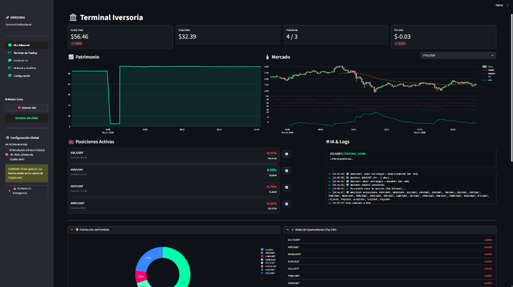

<div align="center">


# INVERSORIA

### Autonomous crypto trading bot with hybrid AI, global macro filters, historical backtesting, exchange wallet intelligence, news catalysts and safe human confirmation.



**🇬🇧 [English](#english-documentation) | 🇪🇸 [Español](#documentación-en-español)**

> Disclaimer: InversorIA is not financial advice. Real mode can place real orders on Crypto.com. Use minimal API permissions, start in simulation, and verify every behavior before trading real funds.

</div>

---

# English Documentation

## Table Of Contents

1. [What Is InversorIA](#what-is-inversoria)
2. [Current Feature Set](#current-feature-set)
3. [Architecture](#architecture)
4. [Decision Pipeline](#decision-pipeline)
5. [Streamlit Interface](#streamlit-interface)
6. [Exchange Wallet And Dust](#exchange-wallet-and-dust)
7. [News And Catalysts](#news-and-catalysts)
8. [Safe AI Assistant](#safe-ai-assistant)
9. [Daemon Diagnostics](#daemon-diagnostics)
10. [Risk Management](#risk-management)
11. [Installation](#installation)
12. [Configuration](#configuration)
13. [Running The System](#running-the-system)
14. [Important Files](#important-files)
15. [SQLite Database](#sqlite-database)
16. [Security](#security)
17. [Troubleshooting](#troubleshooting)
18. [Operational Guidelines](#operational-guidelines)
19. [Suggested Roadmap](#suggested-roadmap)

---

## What Is InversorIA

InversorIA is a local crypto trading system for Crypto.com built with Python, Streamlit, CCXT and SQLite.

It is split into two independent processes:

- `app.py`: Streamlit UI for dashboard, exchange wallet, news, terminal, assistant, history and settings.
- `bot_daemon.py`: autonomous trading loop that scans the market, evaluates signals and places orders according to the configured rules.

Both processes communicate through a local SQLite database, `iversoria.db`. This keeps the UI and the trading daemon independent: you can monitor, inspect and change settings while the bot continues running.

InversorIA supports:

- **Simulation mode**: paper account stored in `simulated_account.json`.
- **Real mode**: real Crypto.com Exchange funds through CCXT.

---

## Current Feature Set

Available today:

- Autonomous daemon with 60-second scan cycles.
- Crypto.com Exchange integration through CCXT.
- Simulation and real trading modes.
- Streamlit dashboard with equity, available cash, open positions, technical chart, radar, macro context and daemon diagnostics.
- Manual sell button from the dashboard.
- Buy candidates are collected during the scan, ranked, and only the best ones are executed after the full cycle evaluation.
- Full exchange wallet view, including balances not tracked by the bot.
- Dust/recoverable-balance classification.
- Sell pre-check: free balance, precision, minimums, notional and order-book slippage.
- Estimated sell economics: buy reference, fees, gross sell, net receive and PnL.
- Robust cost basis detection:
  - open position,
  - trades table,
  - daemon logs,
  - inferred from previous sell PnL.
- Configurable slippage protection:
  - conservative buys,
  - protected automatic sells,
  - manual sells can force market execution when the user explicitly clicks.
- News feed with images, sentiment, impact and manual buy workflow.
- Dashboard quick-news widget.
- Dynamic radar hard-filter for fiat/stablecoin pairs before they can enter the watchlist.
- AI assistant with mandatory explicit UI confirmation before any order.
- Safe configuration import/export with validation, backups and secret blocking.
- AI assistant can propose configuration changes, but the UI requires explicit confirmation before applying them.
- Historical backtesting engine with SQLite priors.
- Incremental global macro refresh with Alpha Vantage.
- Daemon telemetry in the dashboard.

---

## Architecture

```text
┌────────────────────────────────────────────────────────────────────────────┐
│                                INVERSORIA                                  │
├────────────────────────────────────────────────────────────────────────────┤
│                                                                            │
│  app.py (Streamlit UI)                     bot_daemon.py (Autonomous loop) │
│  ─────────────────────                     ─────────────────────────────── │
│  Dashboard                                 60-second scan cycle            │
│  Exchange wallet                           Hot config reload               │
│  News                                      Buy / sell / rotation           │
│  Terminal                                  Weekly backtest                 │
│  Assistant                                 Incremental macro refresh       │
│  History                                   Cycle diagnostics               │
│  Settings                                                                  │
│                                                                            │
│                  ┌─────────────────────────────────────┐                   │
│                  │               SQLite                │                   │
│                  │            iversoria.db             │                   │
│                  ├─────────────────────────────────────┤                   │
│                  │ open_positions                      │                   │
│                  │ trades                              │                   │
│                  │ logs                                │                   │
│                  │ system_status                       │                   │
│                  │ equity_history                      │                   │
│                  │ macro_data                          │                   │
│                  │ backtest_runs / backtest_conditions │                   │
│                  │ chat_history                        │                   │
│                  └─────────────────────────────────────┘                   │
│                                                                            │
└────────────────────────────────────────────────────────────────────────────┘
```

Main modules:

| File | Responsibility |
|---|---|
| `app.py` | Streamlit entrypoint and navigation. |
| `bot_daemon.py` | Autonomous trading daemon. |
| `exchange_helper.py` | Crypto.com / CCXT balances, tickers, inventory, pre-checks and orders. |
| `database_manager.py` | SQLite persistence layer. |
| `decision_engine.py` | Macro, MTF, backtest and AI decision engine. |
| `trading_logic.py` | Indicators, stop-loss, trailing stop and sell logic. |
| `market_context.py` | Crypto/global macro context. |
| `macro_analyzer.py` | Alpha Vantage global market indicators. |
| `backtest_engine.py` | Historical strategy simulations and priors. |
| `multi_timeframe.py` | 1D / 4H / 15M confluence. |
| `sentiment_engine.py` | Gemini / Groq / SambaNova calls and fallback logic. |
| `config_importer.py` | Safe configuration import/export validation and backups. |
| `news_service.py` | RSS news, images, symbol matching, sentiment and impact. |
| `ui_dashboard.py` | Main dashboard. |
| `ui_wallet.py` | Exchange wallet, dust, PnL and manual sell. |
| `ui_news.py` | Full news page and dashboard news widget. |
| `ui_assistant.py` | AI assistant and pending order confirmation. |
| `ui_settings.py` | Hot settings panel. |
| `ui_terminal.py` | Technical terminal and logs. |
| `ui_history.py` | Trade history and analytics. |
| `runtime_bootstrap.py` | Defensive Streamlit hot-reload helpers. |

---

## Decision Pipeline

The daemon runs continuously. Each cycle:

```text
bot_daemon.py
│
├── Reload config / user_settings.json
├── Sync language and simulation/real mode
├── Refresh dynamic watchlist when due
├── Sanitize dynamic watchlist to exclude fiat/stablecoin pairs
├── Run weekly backtest when due
├── Refresh one stale macro asset when due
├── Check if the bot is enabled
├── Set real baseline if needed
└── bot_iteration()
    │
    ├── Fetch total equity
    ├── Log equity history
    ├── Compute effective position limit
    ├── Load open_positions
    └── For each symbol:
        ├── Fetch ticker
        ├── Adopt external position if above threshold
        ├── Fetch OHLCV
        ├── Calculate indicators
        ├── DecisionEngine
        │   ├── Quick technical filter
        │   ├── MacroFilter
        │   ├── Multi-timeframe filter
        │   ├── Backtest prior
        │   └── Hybrid AI
        ├── If open:
        │   └── check_sell_conditions()
        │       ├── Stop loss
        │       ├── Trailing stop
        │       ├── Take profit
        │       └── High-confidence AI SELL
        └── If not open:
            ├── Collect BUY candidate if signal is valid
            └── HOLD if filters block the trade
    │
    ├── Rank all BUY candidates
    │   └── score = confidence + MTF confluence bonus + position size bonus
    ├── Execute top-ranked candidates until available slots are filled
    └── If full, evaluate one rotation using the best remaining candidate
```

Decision layers:

1. **Global macro**
   - Alpha Vantage: `SPY`, `UUP`, `GLD`, `USO`, `VXX`.
   - Incremental refresh: one stale asset per macro interval.
   - Avoids long synchronous blocking.

2. **Crypto macro**
   - BTC dominance.
   - Market regime: `RISK_ON`, `ALTSEASON`, `NEUTRAL`, `CAUTION`, `RISK_OFF`.
   - Can veto altcoin trading during high BTC dominance / risk-off conditions.

3. **Quick technical filter**
   - Avoids wasting AI calls on obvious sideways markets.
   - HOLDs are marked as `TechnicalFilter`.

4. **Multi-timeframe**
   - 1D / 4H / 15M confluence.
   - Can veto long entries if higher timeframes are bearish.

5. **Backtest prior**
   - Historical conditions table stored in SQLite.
   - Uses win rate, profit factor, regime and strategy context.
   - Can veto historically poor conditions.

6. **Hybrid AI**
   - Gemini / Groq / SambaNova fallback.
   - Returns structured JSON: action, confidence, regime, strategy, reasoning.

---

## Streamlit Interface

Launch:

```bash
python -m streamlit run app.py
```

Navigation uses native Streamlit radio buttons to avoid stale visual state from third-party menu components.

### Dashboard

Shows:

- Total equity.
- Available USDT.
- Open positions vs effective maximum.
- PnL vs baseline.
- Mode and daemon state summary.
- Active positions with quick manual sell plus detailed sell options for max or partial amounts.
- Recent bot events.
- Equity curve.
- Technical chart.
- System intelligence:
  - macro context,
  - backtest status,
  - quick news,
  - daemon diagnostics.
- Portfolio distribution.
- Opportunity radar.
- Emergency actions.

### Exchange Wallet

Shows everything reported by the exchange, not only bot positions.

Includes:

- Full inventory.
- Estimated USDT value.
- Whether each asset is tracked by the bot.
- Market precision / minimums when exposed by CCXT.
- Manual sell section with pre-check.
- Final sell grouping:
  1. sellable without bot position,
  2. sellable with bot position,
  3. non-sellable.
- Estimated sell PnL including fees.
- Recoverable dust panel.
- Snapshot text for the assistant.

### News

Crypto catalyst feed.

Current RSS sources:

- Cointelegraph.
- Decrypt.
- CoinDesk.
- NewsBTC.
- Bitcoin Magazine.

Features:

- 15-minute cache.
- Manual refresh.
- Images from RSS metadata.
- Visual fallback when no image exists.
- Filters by source, asset, sentiment and watchlist.
- Simple sentiment and impact labels.
- Copyable assistant context.
- Manual buy from news.

### Terminal

Technical view per asset:

- OHLCV chart.
- EMAs.
- RSI.
- ATR.
- Latest decision.
- Recent logs.
- Optional auto-refresh without blocking navigation.

### AI Assistant

The assistant has context about:

- balance,
- open positions,
- logs,
- macro,
- recent backtests,
- wallet snapshot when generated.

The assistant **does not execute orders automatically**.

If the AI proposes:

```text
[EXECUTE_ORDER]
ACTION: BUY
SYMBOL: BTC/USDT
[/EXECUTE_ORDER]
```

the UI creates a pending order card. The user must click **Confirm order**. The user can also cancel.

### History

Shows:

- Trades.
- Win rate.
- Profit factor.
- Closed trades.
- Best trade.
- Approximate PnL curve.
- Trade journal.

### Settings

Hot-editable settings:

- API keys.
- Simulation / real mode.
- Initial capital.
- Manual position limit priority.
- Maximum positions.
- Risk per trade.
- Minimum profit target.
- Rotation.
- Minimum profit for rotation.
- Confidence gap.
- Minimum new signal confidence.
- AI analysis frequency.
- AI prompts.

Safe configuration import/export:

- Download a clean example JSON for AI review.
- Download the current safe configuration without API keys or secrets.
- Paste JSON from an AI recommendation.
- Validate fields against an allowlist before applying.
- Preview before/after values.
- Block API keys and sensitive fields automatically.
- Create a `user_settings.json.backup-*.json` backup before applying.

---

## Exchange Wallet And Dust

Important distinction:

- **Total equity**: everything reported by the exchange.
- **Bot positions**: rows in `open_positions`.
- **Dust / leftovers**: free balances that exist on the exchange but are not managed as open bot positions.

A recoverable dust balance is:

- a `COIN/USDT` market,
- free balance exists,
- precision is valid,
- minimum amount/notional passes,
- slippage pre-check passes,
- not attached to an active bot position.

Dust can come from:

- rotations,
- fees,
- quantity rounding,
- partial sells,
- manual orders,
- previous exchange balances,
- differences between total and free balances.

### Cost Basis

`get_cost_basis()` tries:

1. `open_positions.entry_price`.
2. Weighted trade history.
3. Daemon buy logs.
4. Inference from previous sell PnL.

If no reliable buy price exists, PnL is not shown.

### Slippage

The system compares a reference price with the order book:

- Buy: conservative limit.
- Automatic sell: protected limit.
- Manual sell: user can force market execution.

Manual sells can still fail if Crypto.com rejects the order because of balance, precision, minimum order size, liquidity or API errors.

---

## News And Catalysts

`news_service.py` normalizes RSS items into:

- title,
- summary,
- source,
- date,
- link,
- image,
- related symbols,
- sentiment,
- impact.

Symbol matching uses the configured watchlist (`config.SYMBOLS`) and also recognizes Bitcoin / Ethereum by name.

The dashboard quick-news widget prioritizes:

- open positions,
- active radar symbols,
- higher impact,
- positive or relevant headlines.

Manual buy from a news card:

- lets the user choose a symbol,
- lets the user choose a USDT amount,
- places a market buy,
- updates average entry if the position already exists,
- saves trade and log.

---

## Safe AI Assistant

The assistant cannot place orders just because the model produced text.

Current flow:

1. User asks for analysis or confirms an intention.
2. AI may output `[EXECUTE_ORDER]`.
3. App detects the block.
4. App creates a pending order.
5. UI shows action, symbol, current price and estimated size.
6. User clicks Confirm or Cancel.
7. Only Confirm executes.

Configuration changes follow the same safety model:

1. User asks the assistant for configuration changes.
2. AI may output `[CONFIG_CHANGE]` with JSON.
3. App validates allowed fields and blocks secrets.
4. UI creates a pending configuration card with a diff.
5. User clicks Apply configuration or Cancel.
6. Only Apply writes to `user_settings.json`, after creating a backup.

This protects against:

- hallucinated actions,
- prompt injection,
- ambiguous confirmations,
- accidental real-money orders.

---

## Daemon Diagnostics

The dashboard includes daemon telemetry:

- current state:
  - `macro_refresh`,
  - `scanning`,
  - `cycle_done`,
  - `sleeping`,
  - `error`,
- age of current state,
- age of last completed cycle,
- scanned symbols,
- open positions vs limit,
- BUY / SELL / HOLD counts,
- top ranked BUY candidates,
- providers:
  - `IA`,
  - `MacroFilter`,
  - `TechnicalFilter`,
  - `MTFFilter`,
- skipped reasons:
  - `NO_PRICE`,
  - `NO_INDICATORS`,
  - `NO_DECISION`,
- top HOLD reasons.

Diagnostics use two timestamps:

- `state_ts`: latest state change.
- `cycle_ts`: latest full cycle completion.

This prevents macro refresh from overwriting the last real scan statistics.

---

## Risk Management

| Parameter | Meaning | Default |
|---|---|---|
| `MODO_SIMULACION` | Simulation vs real mode | `True` |
| `PRESUPUESTO_INICIAL` | Simulation baseline | `60.0` |
| `RISK_PER_TRADE` | % of free USDT used per buy | `0.10` |
| `MAX_OPEN_POSITIONS` | Manual max slots | `5` |
| `MANUAL_MAX_POSITIONS_PRIORITY` | Use manual max instead of dynamic scaling | `False` |
| `MIN_PROFIT_NET` | Normal profit target | `1.0` |
| `STOP_LOSS_PERCENT` | Base stop-loss | `3.0` |
| `ROTATION_ENABLED` | Enable portfolio rotation | `True` |
| `ROTATION_MIN_PROFIT` | Minimum profit before rotating out | `0.35` |
| `ROTATION_CONFIDENCE_GAP` | New signal must exceed old confidence by this much | `0.20` |
| `ROTATION_MIN_NEW_CONFIDENCE` | Minimum confidence for new rotation target | `0.85` |
| `AI_ANALYSIS_INTERVAL` | Deep AI interval per symbol | `1200` seconds |
| `TRADING_FEE_RATE` | Estimated fee per side | `0.001` |
| `BUY_SLIPPAGE_LIMIT` | Max buy slippage | `0.005` |
| `SELL_SLIPPAGE_LIMIT` | Max automatic sell slippage | `0.010` |

Dynamic position scaling when manual priority is disabled:

| Equity | Max positions |
|---|---:|
| `< 100 USDT` | 3 |
| `100 - 300 USDT` | 5 |
| `300 - 600 USDT` | 7 |
| `> 600 USDT` | 10 |

---

## Installation

### Requirements

- Python 3.11+.
- Crypto.com Exchange account.
- Crypto.com API key for real mode.
- Gemini and/or Groq for AI.
- Alpha Vantage for global macro.

### Clone

```bash
git clone https://github.com/R3v180/inversoria
cd inversoria
```

### Virtual Environment

Windows PowerShell:

```powershell
python -m venv venv
.\venv\Scripts\Activate.ps1
pip install -r requirements.txt
```

Windows CMD:

```bat
python -m venv venv
venv\Scripts\activate
pip install -r requirements.txt
```

Linux/macOS:

```bash
python -m venv venv
source venv/bin/activate
pip install -r requirements.txt
```

---

## Configuration

Copy:

```bash
cp .env.example .env
```

Windows:

```bat
copy .env.example .env
```

Fill:

```env
CRYPTO_API_KEY=...
CRYPTO_API_SECRET=...
GOOGLE_API_KEY=...
GROQ_API_KEY=...
SAMBANOVA_API_KEY=...
ALPHA_VANTAGE_API_KEY=...
```

`user_settings.json` is created/updated by the UI. It is local and ignored by Git.

The settings screen also includes safe import/export:

- **Download AI example**: exports a clean JSON template without secrets.
- **Download current safe config**: exports only allowed non-secret settings.
- **Paste JSON configuration**: validates and previews changes before applying.

The importer accepts plain JSON or a fenced `json` block. Sensitive keys are ignored even if they are present.

Ignored sensitive/local files:

- `.env`
- `*.json`
- `*.db`
- `*.db-journal`
- `*.log`
- `*.txt`
- `__pycache__/`
- `*.pyc`

Exceptions:

- `README.md`
- `.env.example`
- `requirements.txt`

---

## Running The System

Terminal 1:

```bash
python -m streamlit run app.py
```

Terminal 2:

```bash
python bot_daemon.py
```

Recommended workflow:

1. Start Streamlit.
2. Configure simulation mode.
3. Start the daemon.
4. Watch Dashboard and Diagnostics.
5. Move to real mode only after understanding all panels.

---

## Important Files

| File | Description | Git |
|---|---|---|
| `.env` | Real secrets | Ignored |
| `user_settings.json` | UI settings and possibly keys | Ignored |
| `iversoria.db` | Local SQLite DB | Ignored |
| `simulated_account.json` | Paper account state | Ignored |
| `iversoria_bot.log` | Local log | Ignored |

---

## SQLite Database

Main tables:

| Table | Purpose |
|---|---|
| `system_status` | Global state, language, mode, diagnostics and decisions. |
| `open_positions` | Bot-managed open positions. |
| `trades` | Buy/sell history. |
| `logs` | Recent logs. |
| `equity_history` | Equity curve. |
| `macro_data` | Alpha Vantage data. |
| `chat_history` | Assistant history. |
| `cooldowns` | Symbol cooldowns. |
| `backtest_runs` | Backtest summaries. |
| `backtest_conditions` | Historical priors by condition. |

---

## Security

Never commit or share:

- `.env`
- `user_settings.json`
- `iversoria.db`
- logs

Crypto.com recommendations:

- Use a dedicated API key.
- Do not enable withdrawals.
- Use IP whitelisting if available.
- Test in simulation first.

Assistant safety:

- AI proposals require explicit UI confirmation.
- No order is executed by free text alone.

---

## Troubleshooting

### Dashboard Navigation Looks Wrong

The app uses native Streamlit navigation. If it still behaves strangely:

1. Refresh browser.
2. Restart Streamlit.
3. Check terminal errors.

### Lots Of HOLDs

This can be normal if:

- BTC dominance is high,
- macro regime is `CAUTION`,
- RSI is neutral,
- ADX is low,
- macro veto is active.

Use daemon diagnostics before changing thresholds.

### High Slippage

The order book is worse than the reference ticker.

- Automatic sells may be blocked.
- Manual sells are sent when the user explicitly clicks.

### Missing PnL For Dust

No reliable buy price was found.

The system tries open position, trades, logs and inferred previous sell PnL.

### RSS Source Error

RSS providers can block or change feeds. The app shows available sources and hides source errors inside an expander.

### `pandas_ta` Import Error

Install:

```bash
pip install pandas-ta
```

The package name is `pandas-ta`; the import is `pandas_ta`.

### Windows Encoding

Use:

```bat
chcp 65001
set PYTHONIOENCODING=utf-8
```

## Operational Guidelines

Simulation:

- Start with `MODO_SIMULACION=True`.
- Observe several cycles.
- Watch HOLD reasons.
- Adjust risk slowly.

Real mode:

- Use small capital first.
- Disable withdrawal permission.
- Review manual orders.
- Do not treat AI output as authority.
- Keep risk per trade conservative.

Dust:

- Sell only when pre-check passes.
- Check estimated PnL if available.
- Avoid excessive rotation on small accounts.

News:

- Treat news as catalysts, not automatic buy signals.
- Check source, chart and macro before buying.

Filters:

- Do not loosen RSI/ADX/confidence blindly.
- Watch diagnostics over multiple cycles first.

---

## Suggested Roadmap

Possible future improvements:

1. Configurable auto-sell for recoverable dust.
2. Slippage settings in the UI.
3. Order audit log.
4. Macro worker thread/process.
5. Web search for the assistant with a controlled API.
6. Bot-quality metrics by provider, regime and strategy.
7. Backtest improvements: fees, slippage, walk-forward, out-of-sample.
8. Risk controls: daily loss limit, max drawdown kill-switch, sector exposure caps.

---

# Documentación En Español

## Índice

1. [Qué Es InversorIA](#qué-es-inversoria)
2. [Funcionalidades Actuales](#funcionalidades-actuales)
3. [Arquitectura](#arquitectura)
4. [Pipeline De Decisión](#pipeline-de-decisión)
5. [Interfaz Streamlit](#interfaz-streamlit-1)
6. [Cartera Exchange Y Retales](#cartera-exchange-y-retales)
7. [Noticias Y Catalizadores](#noticias-y-catalizadores)
8. [Asistente IA Seguro](#asistente-ia-seguro)
9. [Diagnóstico Del Daemon](#diagnóstico-del-daemon)
10. [Gestión De Riesgo](#gestión-de-riesgo)
11. [Instalación](#instalación-1)
12. [Configuración](#configuración-1)
13. [Ejecución](#ejecución)
14. [Archivos Importantes](#archivos-importantes)
15. [Base De Datos SQLite](#base-de-datos-sqlite)
16. [Seguridad](#seguridad-1)
17. [Solución De Problemas](#solución-de-problemas)
18. [Buenas Prácticas](#buenas-prácticas)
19. [Roadmap Sugerido](#roadmap-sugerido-1)

---

## Qué Es InversorIA

InversorIA es un sistema local de trading cripto para Crypto.com construido con Python, Streamlit, CCXT y SQLite.

Está dividido en dos procesos:

- `app.py`: interfaz Streamlit para dashboard, cartera exchange, noticias, terminal, asistente, historial y configuración.
- `bot_daemon.py`: daemon autónomo que escanea mercado, evalúa señales y ejecuta órdenes según reglas configuradas.

Ambos se comunican mediante `iversoria.db`. Esto permite que la UI y el bot funcionen de forma independiente.

Modos disponibles:

- **Simulación**: cuenta ficticia en `simulated_account.json`.
- **Real**: fondos reales de Crypto.com vía CCXT.

---

## Funcionalidades Actuales

- Daemon autónomo con ciclos de 60 segundos.
- Integración Crypto.com Exchange mediante CCXT.
- Modo simulación y modo real.
- Dashboard con equity, liquidez, posiciones, gráfico técnico, radar, macro y diagnóstico.
- Botón de venta manual desde dashboard.
- Los candidatos BUY se recopilan durante el escaneo, se rankean y solo se ejecutan los mejores al final del ciclo.
- Vista de cartera exchange completa.
- Clasificación de retales y polvo recuperable.
- Pre-chequeo de venta: saldo libre, precisión, mínimos, notional y slippage.
- Estimación de PnL al vender con comisiones.
- Cost basis robusto desde posición, trades, logs o inferencia.
- Slippage configurable para compras y ventas automáticas.
- Ventas manuales forzadas por decisión explícita del usuario.
- Noticias RSS con imágenes, sentimiento, impacto y compra manual.
- Widget de noticias rápidas en dashboard.
- Filtro duro del radar dinámico para excluir pares fiat/stablecoin antes de entrar en la watchlist.
- Asistente IA con confirmación obligatoria antes de ejecutar.
- Importación/exportación segura de configuración con validación, backups y bloqueo de secretos.
- El asistente IA puede proponer cambios de configuración, pero la UI exige confirmación explícita antes de aplicarlos.
- Backtesting histórico guardado en SQLite.
- Macro global incremental con Alpha Vantage.
- Diagnóstico del daemon en UI.

---

## Arquitectura

```text
┌────────────────────────────────────────────────────────────────────────────┐
│                                INVERSORIA                                  │
├────────────────────────────────────────────────────────────────────────────┤
│                                                                            │
│  app.py (UI Streamlit)                    bot_daemon.py (Loop autónomo)    │
│  ─────────────────────                    ─────────────────────────────    │
│  Dashboard                                Escaneo cada 60 segundos         │
│  Cartera exchange                         Config en caliente               │
│  Noticias                                 Compra / venta / rotación        │
│  Terminal                                 Backtest semanal                 │
│  Asistente                                Macro incremental                │
│  Historial                                Diagnóstico del ciclo            │
│  Configuración                                                             │
│                                                                            │
│                  ┌─────────────────────────────────────┐                   │
│                  │              SQLite                 │                   │
│                  │            iversoria.db             │                   │
│                  └─────────────────────────────────────┘                   │
│                                                                            │
└────────────────────────────────────────────────────────────────────────────┘
```

Módulos principales:

| Archivo | Responsabilidad |
|---|---|
| `app.py` | Entrada Streamlit y navegación. |
| `bot_daemon.py` | Bot autónomo. |
| `exchange_helper.py` | Crypto.com / CCXT. |
| `database_manager.py` | Persistencia SQLite. |
| `decision_engine.py` | Motor de decisión. |
| `trading_logic.py` | Indicadores, stops y ventas. |
| `market_context.py` | Contexto macro cripto/global. |
| `macro_analyzer.py` | Alpha Vantage incremental. |
| `backtest_engine.py` | Backtesting y priors. |
| `config_importer.py` | Importación/exportación segura de configuración. |
| `news_service.py` | Noticias RSS. |
| `ui_*.py` | Vistas Streamlit. |

---

## Pipeline De Decisión

En cada ciclo:

```text
bot_daemon.py
│
├── Recarga configuración
├── Sincroniza idioma y modo
├── Actualiza watchlist si toca
├── Limpia la watchlist dinámica para excluir pares fiat/stablecoin
├── Ejecuta backtest semanal si toca
├── Refresca un activo macro vencido si toca
├── Comprueba si el bot está activo
└── Por cada símbolo:
    ├── Ticker
    ├── OHLCV
    ├── Indicadores
    ├── Filtro técnico
    ├── MacroFilter
    ├── Multi-timeframe
    ├── Backtest prior
    ├── IA híbrida
    ├── Si hay BUY válido, lo guarda como candidato
    └── HOLD si los filtros bloquean
│
├── Rankea todos los candidatos BUY
│   └── score = confianza + bonus confluencia MTF + bonus sizing
├── Compra los mejores candidatos hasta llenar huecos
└── Si está lleno, evalúa una rotación con el mejor candidato restante
```

Capas:

1. Macro global.
2. Macro cripto.
3. Filtro técnico rápido.
4. Multi-timeframe.
5. Backtest histórico.
6. IA híbrida.

---

## Interfaz Streamlit

Lanzar:

```bash
python -m streamlit run app.py
```

### Dashboard

Muestra primero estado operativo, modo, daemon, posiciones activas y eventos recientes. Después muestra gráfico técnico, curva de patrimonio, inteligencia del sistema, diagnóstico, distribución, radar y acciones de emergencia. En posiciones activas, el botón **Vender** funciona como venta rápida de todo lo posible y el desplegable de opciones permite vender total o parcialmente.

### Cartera Exchange

Muestra todo el inventario del exchange, no solo posiciones del bot.

Orden de venta:

1. Vendible sin posición del bot.
2. Vendible en posición del bot.
3. No vendible.

Incluye pre-chequeo y PnL estimado.

### Noticias

Feeds RSS con imágenes, filtros, sentimiento, impacto y compra manual.

### Terminal

Gráfico técnico por activo, indicadores, decisión reciente y logs.

### Asistente IA

Chat contextual. Las órdenes propuestas pasan a una tarjeta pendiente y requieren botón de confirmación. Los cambios de configuración propuestos por IA siguen el mismo modelo: se muestran como tarjeta pendiente con diff y solo se aplican si el usuario confirma.

### Historial

Trades, win rate, profit factor, curva aproximada y journal.

### Configuración

Permite editar modo, riesgo, posiciones, rotación, frecuencia IA, APIs y prompts.

También incluye importación/exportación segura:

- descargar ejemplo JSON limpio para pasarlo a una IA,
- descargar la configuración actual sin claves ni secretos,
- pegar un JSON recomendado por una IA,
- validar campos permitidos,
- previsualizar valores antes/después,
- bloquear claves API automáticamente,
- crear backup `user_settings.json.backup-*.json` antes de aplicar.

---

## Cartera Exchange Y Retales

Diferencias:

- **Equity total**: todo lo reportado por exchange.
- **Posiciones bot**: filas en `open_positions`.
- **Retales**: saldos libres no gestionados por el bot.

Un retal recuperable:

- tiene par `COIN/USDT`,
- tiene saldo libre,
- pasa precisión,
- pasa mínimo/notional,
- pasa slippage,
- no está en posición activa del bot.

`get_cost_basis()` busca precio de compra en:

1. posición abierta,
2. histórico de trades,
3. logs del daemon,
4. inferencia desde última venta con PnL.

---

## Noticias Y Catalizadores

Fuentes:

- Cointelegraph.
- Decrypt.
- CoinDesk.
- NewsBTC.
- Bitcoin Magazine.

La app extrae:

- titular,
- resumen,
- imagen,
- fuente,
- enlace,
- símbolos relacionados,
- sentimiento,
- impacto.

Desde una noticia se puede comprar manualmente con importe USDT.

---

## Asistente IA Seguro

El asistente no ejecuta órdenes automáticamente.

Flujo:

1. IA propone `[EXECUTE_ORDER]`.
2. La app crea orden pendiente.
3. La UI muestra acción, símbolo, precio y tamaño estimado.
4. Usuario confirma o cancela.
5. Solo confirmar ejecuta.

Para configuración:

1. IA propone `[CONFIG_CHANGE]` con JSON.
2. La app valida claves permitidas y bloquea secretos.
3. La UI muestra una tarjeta pendiente con cambios antes/después.
4. Usuario aplica o cancela.
5. Solo aplicar escribe en `user_settings.json`, con backup previo.

---

## Diagnóstico Del Daemon

Muestra:

- estado actual,
- edad del estado,
- edad del último ciclo,
- símbolos escaneados,
- posiciones,
- BUY / SELL / HOLD,
- top candidatos BUY,
- providers,
- skipped,
- principales motivos HOLD.

Estados:

- `macro_refresh`
- `scanning`
- `cycle_done`
- `sleeping`
- `error`

---

## Gestión De Riesgo

| Parámetro | Significado | Default |
|---|---|---|
| `MODO_SIMULACION` | Simulación vs real | `True` |
| `PRESUPUESTO_INICIAL` | Baseline sim | `60.0` |
| `RISK_PER_TRADE` | % de USDT libre por compra | `0.10` |
| `MAX_OPEN_POSITIONS` | Máximo manual | `5` |
| `MANUAL_MAX_POSITIONS_PRIORITY` | Prioriza máximo manual | `False` |
| `MIN_PROFIT_NET` | Profit objetivo | `1.0` |
| `STOP_LOSS_PERCENT` | Stop loss base | `3.0` |
| `ROTATION_ENABLED` | Activa rotación | `True` |
| `ROTATION_MIN_PROFIT` | Profit mínimo para rotar | `0.35` |
| `ROTATION_CONFIDENCE_GAP` | Gap de confianza | `0.20` |
| `ROTATION_MIN_NEW_CONFIDENCE` | Confianza mínima nueva | `0.85` |
| `AI_ANALYSIS_INTERVAL` | Frecuencia IA | `1200` |
| `TRADING_FEE_RATE` | Fee estimada | `0.001` |
| `BUY_SLIPPAGE_LIMIT` | Slippage compra | `0.005` |
| `SELL_SLIPPAGE_LIMIT` | Slippage venta automática | `0.010` |

Escala dinámica:

| Equity | Máx posiciones |
|---|---:|
| `< 100 USDT` | 3 |
| `100 - 300 USDT` | 5 |
| `300 - 600 USDT` | 7 |
| `> 600 USDT` | 10 |

---

## Instalación

```bash
git clone https://github.com/R3v180/inversoria
cd inversoria
python -m venv venv
```

Windows PowerShell:

```powershell
.\venv\Scripts\Activate.ps1
pip install -r requirements.txt
```

Linux/macOS:

```bash
source venv/bin/activate
pip install -r requirements.txt
```

---

## Configuración

```bash
cp .env.example .env
```

Windows:

```bat
copy .env.example .env
```

Rellena:

```env
CRYPTO_API_KEY=...
CRYPTO_API_SECRET=...
GOOGLE_API_KEY=...
GROQ_API_KEY=...
SAMBANOVA_API_KEY=...
ALPHA_VANTAGE_API_KEY=...
```

`user_settings.json` es local y está ignorado.

La UI permite importar/exportar configuración segura:

- ejemplo para IA,
- config actual sin secretos,
- validación de JSON pegado,
- preview de cambios,
- backup automático antes de aplicar.

---

## Ejecución

Terminal 1:

```bash
python -m streamlit run app.py
```

Terminal 2:

```bash
python bot_daemon.py
```

---

## Archivos Importantes

| Archivo | Descripción | Git |
|---|---|---|
| `.env` | Secretos | Ignorado |
| `user_settings.json` | Config UI | Ignorado |
| `iversoria.db` | SQLite | Ignorado |
| `simulated_account.json` | Cuenta sim | Ignorado |
| `iversoria_bot.log` | Log local | Ignorado |

---

## Base De Datos SQLite

Tablas:

- `system_status`
- `open_positions`
- `trades`
- `logs`
- `equity_history`
- `macro_data`
- `chat_history`
- `cooldowns`
- `backtest_runs`
- `backtest_conditions`

---

## Seguridad

No compartas ni subas:

- `.env`
- `user_settings.json`
- `iversoria.db`
- logs

Recomendación Crypto.com:

- API key dedicada.
- Sin permisos de retiro.
- IP whitelist si existe.
- Probar primero en simulación.

---

## Solución De Problemas

### Muchas señales HOLD

Puede ser normal si hay:

- dominancia BTC alta,
- régimen `CAUTION`,
- RSI lateral,
- ADX bajo,
- veto macro.

### Slippage alto

El libro de órdenes está peor que el ticker.

- Automático: puede bloquearse.
- Manual: se envía si pulsas vender.

### PnL desconocido en retal

No hay precio de compra fiable.

### RSS falla

Las fuentes pueden bloquear. La app muestra lo disponible.

### `pandas_ta`

```bash
pip install pandas-ta
```

---

## Buenas Prácticas

- Empieza en simulación.
- Observa varios ciclos.
- Revisa diagnóstico antes de tocar filtros.
- No uses la IA como autoridad final.
- Compra manual solo con catalizador + gráfico + macro.
- Mantén riesgo bajo en real.

---

## Roadmap Sugerido

1. Auto-venta configurable de retales.
2. Slippage configurable desde UI.
3. Auditoría de órdenes.
4. Macro worker dedicado.
5. Búsqueda web controlada para asistente.
6. Métricas por provider/régimen/estrategia.
7. Backtest con slippage, fees reales y walk-forward.
8. Daily loss limit y kill-switch por drawdown.

---

<div align="center">

**INVERSORIA**  
Local hybrid-AI crypto trading bot with macro awareness, backtesting, news, diagnostics and human-in-the-loop execution.

</div>
